# WI 입력·산출물 관계도

> 각 WI(업무지침서)의 **4. 입력 자료 / 산출물** 섹션에서 추출한 Input·Output 연결 관계.
> - 파란 노드: WI (업무지침서)
> - 주황 노드: TMP (템플릿/산출 양식)
> - `입력` 화살표: TMP → WI (해당 WI 수행 시 필요한 입력 양식)
> - `산출` 화살표: WI → TMP (해당 WI 수행 결과 생성되는 양식)
> - `선행` 화살표: WI → WI (선행 지침 의존 관계)

```mermaid
graph LR

%% ─── 스타일 ───────────────────────────────────
classDef wi   fill:#4A90D9,stroke:#2c5f8a,color:#fff,rx:6
classDef tmp  fill:#F5A623,stroke:#b8791a,color:#fff,rx:4
classDef wiw  fill:#7ED321,stroke:#4a7d13,color:#fff,rx:6

  subgraph SG_101_보안_문서화_관리["101 보안 문서화 관리"]
    WI_101_01_보안문서_등록["WI-101-01
보안문서 등록 업무지침"]:::wi
    WI_101_02_문서_갱신_및_폐기["WI-101-02
문서 갱신 및 폐기 업무지침"]:::wi
    WI_101_03_증적_수집_기준["WI-101-03
증적 수집 기준 업무지침"]:::wi
  end
  subgraph SG_201_사이버보안_리스크_관리["201 사이버보안 리스크 관리"]
    WI_201_01_STRIDE_위협모델링["WI-201-01
STRIDE 위협모델링 업무지침"]:::wi
    WI_201_02_취약점_평가_스캐닝["WI-201-02
취약점 평가·스캐닝 업무지침"]:::wi
    WI_201_03_위험_평가_보고서_작성["WI-201-03
위험 평가 보고서 작성 업무지침"]:::wi
    WI_201_04_잔여_위험_수용["WI-201-04
잔여 위험 수용 업무지침"]:::wi
    WI_201_05_시판후_지속감시["WI-201-05
시판 후 지속 감시 업무지침"]:::wi
    WI_201_06_AI_데이터_모델_위협평가["WI-201-06
AI 데이터·모델 위협평가 업무지침"]:::wi
  end
  subgraph SG_301_303_보안_SDLC___SBOM___레거시["301-303 보안 SDLC / SBOM / 레거시"]
    WI_301_01_보안_요구사항_정의["WI-301-01
보안 요구사항 정의 업무지침"]:::wi
    WI_301_02_보안_코딩_표준["WI-301-02
보안 코딩 표준 업무지침"]:::wi
    WI_301_03_SAST_DAST_운영["WI-301-03
SAST·DAST 운영 업무지침"]:::wi
    WI_301_04_Fuzzing_퍼징["WI-301-04
Fuzzing(퍼징) 업무지침"]:::wi
    WI_301_05_모의_침투_테스트["WI-301-05
모의 침투 테스트 업무지침"]:::wi
    WI_301_06_도구_유효성_확인["WI-301-06
도구 유효성 확인 업무지침"]:::wi
    WI_301_07_릴리스_보안_게이트["WI-301-07
릴리스 보안 게이트 업무지침"]:::wi
    WI_302_01_SBOM_생성_및_포맷["WI-302-01
SBOM 생성 및 포맷 업무지침"]:::wi
    WI_302_02_CVE_NVD_연동["WI-302-02
CVE·NVD 연동 업무지침"]:::wi
    WI_302_03_SBOM_보호_보안통신_저장["WI-302-03
SBOM 보호·보안 통신·저장 업무지침"]:::wi
    WI_302_04_SBOM_MSP_제공_계약_포털["WI-302-04
SBOM MSP 제공·계약·포털 운영 업무지침"]:::wi
    WI_302_05_SBOM_침해대응_연계["WI-302-05
SBOM 침해대응 연계 업무지침"]:::wi
    WI_303_01_EOS_설계_원칙["WI-303-01
EOS 설계 원칙 업무지침"]:::wi
    WI_303_02_EOS_일정_지원계획_공지["WI-303-02
EOS 일정 및 지원 계획 공지 업무지침"]:::wi
    WI_303_03_레거시_취약점_패치_협력["WI-303-03
레거시 취약점 패치 협력 업무지침"]:::wi
    WI_303_04_폐기_및_데이터_안전삭제["WI-303-04
폐기 및 데이터 안전 삭제 업무지침"]:::wi
  end
  subgraph SG_401_403_접근통제___통신___데이터_보안["401-403 접근통제 · 통신 · 데이터 보안"]
    WI_401_01_계정_생명주기["WI-401-01
계정 생명주기 관리 업무지침"]:::wi
    WI_401_02_세션_및_쿠키_관리["WI-401-02
세션 및 쿠키 관리 업무지침"]:::wi
    WI_401_03_MFA_및_패스워드_정책["WI-401-03
MFA 및 패스워드 정책 업무지침"]:::wi
    WI_401_04_원격접속_관리["WI-401-04
원격접속 관리 업무지침"]:::wi
    WI_402_01_네트워크_보안_설정["WI-402-01
네트워크 보안 설정 업무지침"]:::wi
    WI_402_02_이동식매체_통제["WI-402-02
이동식매체 통제 업무지침"]:::wi
    WI_402_03_통신_암호화["WI-402-03
통신 암호화 업무지침"]:::wi
    WI_402_04_암호키_수명주기["WI-402-04
암호키 수명주기 관리 업무지침"]:::wi
    WI_402_05_HSM_KMS_운영["WI-402-05
HSM/KMS 운영 업무지침"]:::wi
    WI_403_01_파일_업다운로드_검증["WI-403-01
파일 업·다운로드 검증 업무지침"]:::wi
    WI_403_02_실행파일_차단["WI-403-02
실행파일 차단 업무지침"]:::wi
    WI_403_03_입력_검증_및_SAST["WI-403-03
입력 검증 및 SAST 운영 업무지침"]:::wi
    WI_403_04_DB_보안_관리["WI-403-04
DB 보안 관리 업무지침"]:::wi
    WI_403_05_개인정보_비식별화["WI-403-05
개인정보 비식별화 업무지침"]:::wi
    WI_403_06_데이터_전송_암호화["WI-403-06
데이터 전송 암호화 업무지침"]:::wi
  end
  subgraph SG_501_502_보안_모니터링___침해사고_대응["501-502 보안 모니터링 · 침해사고 대응"]
    WI_501_01_SIEM_운영["WI-501-01
SIEM 운영 업무지침"]:::wi
    WI_501_02_시스템_하드닝["WI-501-02
시스템 하드닝 업무지침"]:::wi
    WI_501_03_무결성_검증_FIM["WI-501-03
무결성 검증(FIM) 업무지침"]:::wi
    WI_501_04_백업_복구_모의훈련["WI-501-04
백업 및 복구 모의훈련 업무지침"]:::wi
    WI_501_05_안티바이러스_운영["WI-501-05
안티바이러스 운영 업무지침"]:::wi
    WI_501_06_로그_관리_및_분석["WI-501-06
로그 관리 및 분석 업무지침"]:::wi
    WI_501_07_물리_보안구역_출입통제["WI-501-07
물리 보안구역 및 출입통제 업무지침"]:::wi
    WI_501_08_전산실_강화보안["WI-501-08
전산실 강화보안 업무지침"]:::wi
    WI_502_01_침해_인지_및_초기분석["WI-502-01
침해 인지 및 초기 분석 업무지침"]:::wi
    WI_502_02_대외신고_식약처_MSP_이용자["WI-502-02
대외 신고(식약처·MSP·이용자) 업무지침"]:::wi
    WI_502_03_격리_및_복구_포렌식["WI-502-03
격리·복구·포렌식 업무지침"]:::wi
    WI_502_04_BCP_및_Fail_safe["WI-502-04
BCP 및 Fail-safe 업무지침"]:::wi
    WI_502_05_CSIRT_구성_및_훈련["WI-502-05
CSIRT 구성 및 훈련 업무지침"]:::wi
    WI_502_06_재발방지_및_사후분석["WI-502-06
재발방지 및 사후분석 업무지침"]:::wi
  end
  subgraph SG_601_취약점_감시___VDP___패치["601 취약점 감시 · VDP · 패치"]
    WI_601_01_취약점_감시_및_접수["WI-601-01
취약점 감시 및 접수 업무지침"]:::wi
    WI_601_02_VDP_운영_외부연구자["WI-601-02
VDP 운영 및 외부 보안 연구자 대응 업무지침"]:::wi
    WI_601_03_식약처_MSP_통보["WI-601-03
식약처·MSP 취약점 통보 업무지침"]:::wi
    WI_601_04_홈페이지_공개_및_조정공개["WI-601-04
홈페이지 공개 및 조정 공개 업무지침"]:::wi
    WI_601_05_패치_및_업데이트_배포["WI-601-05
패치 및 업데이트 배포 업무지침"]:::wi
    WI_601_06_조치후_감시_및_재발검증["WI-601-06
조치 후 감시 및 재발검증 업무지침"]:::wi
  end

%% ─── TMP 노드 ──────────────────────────────────
  TMP_ACC_001_권한_신청서["TMP-ACC-001"]:::tmp
  TMP_ACC_002_권한_검토_대장["TMP-ACC-002"]:::tmp
  TMP_ACC_003_MFA_등록대장["TMP-ACC-003"]:::tmp
  TMP_ACC_004_원격접속_신청서["TMP-ACC-004"]:::tmp
  TMP_DBA_001_DB_계정_신청서["TMP-DBA-001"]:::tmp
  TMP_DBA_002_DB_권한_검토_대장["TMP-DBA-002"]:::tmp
  TMP_DBA_003_민감컬럼_암호화_현황표["TMP-DBA-003"]:::tmp
  TMP_DEV_021_실행파일_차단_예외_신청서["TMP-DEV-021"]:::tmp
  TMP_DEV_022_실행파일_화이트리스트_대장["TMP-DEV-022"]:::tmp
  TMP_DOC_001_보안문서_등록신청서["TMP-DOC-001"]:::tmp
  TMP_DOC_002_증적_목록표["TMP-DOC-002"]:::tmp
  TMP_EOS_001_EOS_공지서["TMP-EOS-001"]:::tmp
  TMP_EOS_002_데이터_안전삭제_지침["TMP-EOS-002"]:::tmp
  TMP_FAC_010_전산실_출입_기록대장["TMP-FAC-010"]:::tmp
  TMP_FAC_011_전산실_환경_점검_일지["TMP-FAC-011"]:::tmp
  TMP_FAC_012_장비_반출입_신청서["TMP-FAC-012"]:::tmp
  TMP_INF_011_이동식매체_사용_신청서["TMP-INF-011"]:::tmp
  TMP_INF_012_이동식매체_사용_대장["TMP-INF-012"]:::tmp
  TMP_IR_001_침해_초기분석_보고서["TMP-IR-001"]:::tmp
  TMP_IR_002_초기_대외신고서["TMP-IR-002"]:::tmp
  TMP_IR_003_지속정보공유_리포트["TMP-IR-003"]:::tmp
  TMP_IR_004_포렌식_분석보고서["TMP-IR-004"]:::tmp
  TMP_IR_005_CSIRT_훈련_시나리오["TMP-IR-005"]:::tmp
  TMP_IR_006_CSIRT_역할_책임표["TMP-IR-006"]:::tmp
  TMP_IR_040_BCP_발동_기록["TMP-IR-040"]:::tmp
  TMP_IR_041_Fail_safe_전환_체크리스트["TMP-IR-041"]:::tmp
  TMP_IR_042_비상_운영_현황판["TMP-IR-042"]:::tmp
  TMP_IR_060_근본원인분석_보고서["TMP-IR-060"]:::tmp
  TMP_IR_061_재발방지_대책_이행계획["TMP-IR-061"]:::tmp
  TMP_IR_062_사후검토_회의_기록["TMP-IR-062"]:::tmp
  TMP_KMS_001_암호키_인벤토리_대장["TMP-KMS-001"]:::tmp
  TMP_KMS_002_HSM_접근_감사_로그["TMP-KMS-002"]:::tmp
  TMP_KMS_003_키_로테이션_체크리스트["TMP-KMS-003"]:::tmp
  TMP_LOG_001_SIEM_룰_관리대장["TMP-LOG-001"]:::tmp
  TMP_LOG_002_복구_모의훈련_결과서["TMP-LOG-002"]:::tmp
  TMP_LOG_003_로그분석_보고서["TMP-LOG-003"]:::tmp
  TMP_NET_001_네트워크_변경관리서["TMP-NET-001"]:::tmp
  TMP_NET_002_TLS_인증서_인벤토리["TMP-NET-002"]:::tmp
  TMP_NET_003_암호키_인벤토리["TMP-NET-003"]:::tmp
  TMP_OPS_010_하드닝_체크리스트["TMP-OPS-010"]:::tmp
  TMP_OPS_011_예외_승인서["TMP-OPS-011"]:::tmp
  TMP_OPS_020_FIM_모니터링_대장["TMP-OPS-020"]:::tmp
  TMP_OPS_021_FIM_알림_처리_기록["TMP-OPS-021"]:::tmp
  TMP_OPS_030_AV_운영_현황_대장["TMP-OPS-030"]:::tmp
  TMP_OPS_031_AV_탐지_대응_기록["TMP-OPS-031"]:::tmp
  TMP_PHY_001_출입기록_대장["TMP-PHY-001"]:::tmp
  TMP_PRIV_001_비식별화_조치_내역서["TMP-PRIV-001"]:::tmp
  TMP_RISK_001_STRIDE_워크시트["TMP-RISK-001"]:::tmp
  TMP_RISK_002_위험평가_보고서["TMP-RISK-002"]:::tmp
  TMP_RISK_003_AI_위협평가_워크시트["TMP-RISK-003"]:::tmp
  TMP_SBOM_001_SBOM_검증_체크리스트["TMP-SBOM-001"]:::tmp
  TMP_SDLC_001_파일검증_설계서["TMP-SDLC-001"]:::tmp
  TMP_SDLC_002_보안_요구사항_정의서["TMP-SDLC-002"]:::tmp
  TMP_SDLC_003_릴리스_보안_게이트_체크리스트["TMP-SDLC-003"]:::tmp
  TMP_TLS_001_인증서_관리_대장["TMP-TLS-001"]:::tmp
  TMP_TLS_002_전송_암호화_적용_현황표["TMP-TLS-002"]:::tmp
  TMP_VDP_020_외부신고_접수_대장["TMP-VDP-020"]:::tmp
  TMP_VDP_021_연구자_임시계정_발급서["TMP-VDP-021"]:::tmp
  TMP_VDP_022_보상_지급_기록["TMP-VDP-022"]:::tmp
  TMP_VDP_060_조치후_감시_보고서["TMP-VDP-060"]:::tmp
  TMP_VDP_061_재발검증_스캔_기록["TMP-VDP-061"]:::tmp
  TMP_VDP_062_취약점_종결_확인서["TMP-VDP-062"]:::tmp
  TMP_VUL_001_취약점_접수_대장["TMP-VUL-001"]:::tmp
  TMP_VUL_002_취약점_통보서["TMP-VUL-002"]:::tmp
  TMP_VUL_003_취약점_공개자료["TMP-VUL-003"]:::tmp
  TMP_VUL_004_패치_배포_체크리스트["TMP-VUL-004"]:::tmp

%% ─── 엣지 ─────────────────────────────────────
  WI_101_01_보안문서_등록 -->|산출| TMP_DOC_001_보안문서_등록신청서
  TMP_DOC_002_증적_목록표 -->|입력| WI_101_03_증적_수집_기준
  WI_201_01_STRIDE_위협모델링 -->|산출| TMP_RISK_001_STRIDE_워크시트
  WI_201_03_위험_평가_보고서_작성 -->|산출| TMP_RISK_002_위험평가_보고서
  WI_201_06_AI_데이터_모델_위협평가 -->|산출| TMP_RISK_003_AI_위협평가_워크시트
  WI_301_01_보안_요구사항_정의 -->|산출| TMP_SDLC_002_보안_요구사항_정의서
  WI_301_07_릴리스_보안_게이트 -->|산출| TMP_SDLC_003_릴리스_보안_게이트_체크리스트
  WI_302_01_SBOM_생성_및_포맷 -->|산출| TMP_SBOM_001_SBOM_검증_체크리스트
  WI_303_02_EOS_일정_지원계획_공지 -->|산출| TMP_EOS_001_EOS_공지서
  WI_303_04_폐기_및_데이터_안전삭제 -->|산출| TMP_EOS_002_데이터_안전삭제_지침
  TMP_ACC_001_권한_신청서 -->|입력| WI_401_01_계정_생명주기
  WI_401_01_계정_생명주기 -->|산출| TMP_ACC_002_권한_검토_대장
  WI_401_01_계정_생명주기 -->|선행| WI_401_03_MFA_및_패스워드_정책
  TMP_ACC_003_MFA_등록대장 -->|입력| WI_401_03_MFA_및_패스워드_정책
  TMP_ACC_004_원격접속_신청서 -->|입력| WI_401_04_원격접속_관리
  WI_401_01_계정_생명주기 -->|선행| WI_401_04_원격접속_관리
  TMP_NET_001_네트워크_변경관리서 -->|입력| WI_402_01_네트워크_보안_설정
  TMP_INF_011_이동식매체_사용_신청서 -->|입력| WI_402_02_이동식매체_통제
  WI_402_02_이동식매체_통제 -->|산출| TMP_INF_012_이동식매체_사용_대장
  WI_402_03_통신_암호화 -->|산출| TMP_NET_002_TLS_인증서_인벤토리
  TMP_NET_003_암호키_인벤토리 -->|입력| WI_402_04_암호키_수명주기
  WI_402_05_HSM_KMS_운영 -->|산출| TMP_KMS_001_암호키_인벤토리_대장
  WI_402_05_HSM_KMS_운영 -->|산출| TMP_KMS_002_HSM_접근_감사_로그
  WI_402_05_HSM_KMS_운영 -->|산출| TMP_KMS_003_키_로테이션_체크리스트
  WI_403_01_파일_업다운로드_검증 -->|산출| TMP_SDLC_001_파일검증_설계서
  TMP_DEV_021_실행파일_차단_예외_신청서 -->|입력| WI_403_02_실행파일_차단
  WI_403_02_실행파일_차단 -->|산출| TMP_DEV_022_실행파일_화이트리스트_대장
  TMP_DBA_001_DB_계정_신청서 -->|입력| WI_403_04_DB_보안_관리
  WI_403_04_DB_보안_관리 -->|산출| TMP_DBA_002_DB_권한_검토_대장
  WI_403_04_DB_보안_관리 -->|산출| TMP_DBA_003_민감컬럼_암호화_현황표
  WI_403_05_개인정보_비식별화 -->|산출| TMP_PRIV_001_비식별화_조치_내역서
  TMP_TLS_002_전송_암호화_적용_현황표 -->|입력| WI_403_06_데이터_전송_암호화
  WI_403_06_데이터_전송_암호화 -->|산출| TMP_TLS_001_인증서_관리_대장
  WI_403_06_데이터_전송_암호화 -->|산출| TMP_TLS_002_전송_암호화_적용_현황표
  TMP_LOG_001_SIEM_룰_관리대장 -->|입력| WI_501_01_SIEM_운영
  TMP_OPS_010_하드닝_체크리스트 -->|입력| WI_501_02_시스템_하드닝
  WI_501_02_시스템_하드닝 -->|산출| TMP_OPS_010_하드닝_체크리스트
  WI_501_02_시스템_하드닝 -->|산출| TMP_OPS_011_예외_승인서
  TMP_OPS_020_FIM_모니터링_대장 -->|입력| WI_501_03_무결성_검증_FIM
  WI_501_03_무결성_검증_FIM -->|산출| TMP_OPS_021_FIM_알림_처리_기록
  WI_501_04_백업_복구_모의훈련 -->|산출| TMP_LOG_002_복구_모의훈련_결과서
  TMP_OPS_030_AV_운영_현황_대장 -->|입력| WI_501_05_안티바이러스_운영
  WI_501_05_안티바이러스_운영 -->|산출| TMP_OPS_030_AV_운영_현황_대장
  WI_501_05_안티바이러스_운영 -->|산출| TMP_OPS_031_AV_탐지_대응_기록
  WI_501_06_로그_관리_및_분석 -->|산출| TMP_LOG_003_로그분석_보고서
  WI_501_07_물리_보안구역_출입통제 -->|산출| TMP_PHY_001_출입기록_대장
  TMP_FAC_010_전산실_출입_기록대장 -->|입력| WI_501_08_전산실_강화보안
  TMP_FAC_011_전산실_환경_점검_일지 -->|입력| WI_501_08_전산실_강화보안
  TMP_FAC_012_장비_반출입_신청서 -->|입력| WI_501_08_전산실_강화보안
  WI_501_08_전산실_강화보안 -->|산출| TMP_FAC_010_전산실_출입_기록대장
  WI_501_08_전산실_강화보안 -->|산출| TMP_FAC_011_전산실_환경_점검_일지
  WI_501_08_전산실_강화보안 -->|산출| TMP_FAC_012_장비_반출입_신청서
  WI_502_01_침해_인지_및_초기분석 -->|산출| TMP_IR_001_침해_초기분석_보고서
  WI_502_01_침해_인지_및_초기분석 -->|선행| WI_502_02_대외신고_식약처_MSP_이용자
  WI_502_02_대외신고_식약처_MSP_이용자 -->|산출| TMP_IR_002_초기_대외신고서
  WI_502_02_대외신고_식약처_MSP_이용자 -->|산출| TMP_IR_003_지속정보공유_리포트
  WI_502_03_격리_및_복구_포렌식 -->|산출| TMP_IR_004_포렌식_분석보고서
  TMP_IR_041_Fail_safe_전환_체크리스트 -->|입력| WI_502_04_BCP_및_Fail_safe
  WI_502_04_BCP_및_Fail_safe -->|산출| TMP_IR_040_BCP_발동_기록
  WI_502_04_BCP_및_Fail_safe -->|산출| TMP_IR_041_Fail_safe_전환_체크리스트
  WI_502_04_BCP_및_Fail_safe -->|산출| TMP_IR_042_비상_운영_현황판
  WI_502_05_CSIRT_구성_및_훈련 -->|산출| TMP_IR_006_CSIRT_역할_책임표
  WI_502_05_CSIRT_구성_및_훈련 -->|산출| TMP_IR_005_CSIRT_훈련_시나리오
  WI_502_06_재발방지_및_사후분석 -->|산출| TMP_IR_060_근본원인분석_보고서
  WI_502_06_재발방지_및_사후분석 -->|산출| TMP_IR_061_재발방지_대책_이행계획
  WI_502_06_재발방지_및_사후분석 -->|산출| TMP_IR_062_사후검토_회의_기록
  WI_601_01_취약점_감시_및_접수 -->|산출| TMP_VUL_001_취약점_접수_대장
  TMP_VDP_020_외부신고_접수_대장 -->|입력| WI_601_02_VDP_운영_외부연구자
  WI_601_02_VDP_운영_외부연구자 -->|산출| TMP_VDP_020_외부신고_접수_대장
  WI_601_02_VDP_운영_외부연구자 -->|산출| TMP_VDP_021_연구자_임시계정_발급서
  WI_601_02_VDP_운영_외부연구자 -->|산출| TMP_VDP_022_보상_지급_기록
  WI_601_03_식약처_MSP_통보 -->|산출| TMP_VUL_002_취약점_통보서
  WI_601_04_홈페이지_공개_및_조정공개 -->|산출| TMP_VUL_003_취약점_공개자료
  WI_601_05_패치_및_업데이트_배포 -->|산출| TMP_VUL_004_패치_배포_체크리스트
  WI_601_06_조치후_감시_및_재발검증 -->|산출| TMP_VDP_060_조치후_감시_보고서
  WI_601_06_조치후_감시_및_재발검증 -->|산출| TMP_VDP_061_재발검증_스캔_기록
  WI_601_06_조치후_감시_및_재발검증 -->|산출| TMP_VDP_062_취약점_종결_확인서
```

