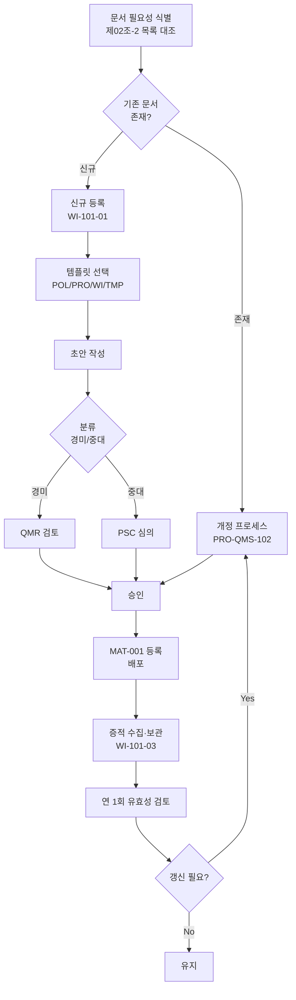

# 보안 문서화 관리 절차 (PRO-MDCS-101)

> 상위 정책: [[POL-MDCS-001_의료기기_사이버보안_기본방침_v1.0]]
> 연계: [[GS-PRO-QMS-102_문서_개정_관리_절차]] (전사 QMS 문서관리)

## 1. 목적

SaMD-CSMS 제3~22조의 모든 보안 활동이 수행 사실·절차·책임·도구·결과물의 관점에서 **재현 가능한 형태로 문서화**되도록, 보안 문서의 목록·등록·갱신·보관·폐기 라이프사이클을 정의한다.

## 2. 적용 범위

본 절차는 SaMD-CSMS 에 따라 생성되는 다음 4개 영역의 문서에 적용한다.

1. **물리적·기술적 보안체계 문서** (제3~12조 — 접근통제·암호·모니터링·AI 보안)
2. **전자적 침해행위 대응 문서** (제17~19조 — 대응계획·신고·조치)
3. **위험·개발·레거시·SBOM 문서** (제13~16조)
4. **침해사고 대응 및 취약점 감시 문서** (제18·20~22조)

제02조-2 "보안 문서 목록"(부속서)은 본 절차 하위 WI 의 **초기 골든 인풋**으로 사용한다.

## 3. 역할과 책임 (RACI)

| 단계 | Doc Owner | PSO | QMR | PSC | CISO |
|---|---|---|---|---|---|
| 문서 목록 수립·갱신 | C | **R** | C | - | **A** |
| 신규 문서 등록 | **R** | A | C | - | - |
| 문서 개정 심의 (경미) | C | **R** | **A** | I | - |
| 문서 개정 심의 (중대) | C | C | C | **A** | I |
| 증적 수집·보관 | **R** | C | A | - | - |
| 연 1회 문서 유효성 검토 | C | **R** | A | I | **A** |

> Doc Owner: 해당 보안 문서의 실질 담당 부서(개발·SecOps·CSIRT 등).

## 4. 절차 흐름



## 5. 단계별 상세

| #   | 단계        | 설명                                           | 담당        | 입력                  | 출력                 |
| --- | --------- | -------------------------------------------- | --------- | ------------------- | ------------------ |
| 1   | 문서 필요성 식별 | 제02조-2 문서 목록을 대조하여 누락·추가 필요 문서를 식별           | PSO       | SaMD-CSMS 목록, 제품 요구 | 문서 Gap 리스트         |
| 2   | 분류 판단     | 신규/개정 및 경미/중대 판단                             | Doc Owner | Gap 리스트             | 분류 태그              |
| 3   | 초안 작성     | T03/T04/T05/T06 템플릿 사용                       | Doc Owner | 템플릿                 | 문서 초안              |
| 4   | 검토·심의     | 경미는 QMR, 중대는 PSC                             | QMR/PSC   | 초안                  | 심의 결과              |
| 5   | 승인        | 경미: QMR, 중대: CISO                            | QMR/CISO  | 심의 결과               | 승인본                |
| 6   | 배포·등록     | MAT-001 등록, 공지, 접근 권한 부여                     | Doc Owner | 승인본                 | 배포 공지, MAT-001 레코드 |
| 7   | 증적 수집     | 보안 활동의 수행 증적(로그·스캐너 리포트·훈련 결과 등) 수집·변조 방지 보관 | Doc Owner | 활동 결과               | 증적 레코드(REC)        |
| 8   | 유효성 검토    | 연 1회 이상 문서 유효성·최신성 검토                        | PSO       | 전체 문서 목록            | 검토 보고서             |

## 6. 연계 업무지침 (WI)

- [[WI-101-01_보안문서_등록_v0.1]] — 신규 등록 세부
- [[WI-101-02_문서_갱신_및_폐기_v0.1]] — 갱신·폐기 세부
- [[WI-101-03_증적_수집_기준_v0.1]] — 증적 수집·변조방지 보관

## 7. 통제점 / KPI

| 통제점 | 지표 | 목표 | 주기 |
|---|---|---|---|
| 제02조-2 문서 목록 커버리지 | 목록 대비 등록 문서 비율 | 100% | 분기 |
| 문서 최신성 | 최근 12개월 내 검토·갱신 비율 | ≥ 95% | 연 |
| 승인 없는 배포 | 부적합 건수 | 0건 | 분기 |
| 증적 누락 | 보안 활동 대비 증적 보관률 | ≥ 98% | 분기 |
| MAT-001 등록율 | 승인본 대비 등록 | 100% | 월 |

## 8. 표준 매핑 (Traceability)

| 표준 조항 | Req-ID | 반영 위치 |
|---|---|---|
| SaMD-CSMS 제02조 제1호 (수행 사실·절차·책임·결과 문서화) | MDCS-R-021 | §4 흐름, §5 단계 1~7 |
| SaMD-CSMS 제02조 제2호 (4개 영역 문서화) | MDCS-R-022 | §2 적용 범위 |
| SaMD-CSMS 제02조 제3호 (문서 목록·갱신 이력) | MDCS-R-023 | §5 단계 6, §7 KPI |
| ISO 9001 §7.5 | — | §4~§5 |

## 9. 출처 (source_citation)

```yaml
- type: guide
  file: "_inputs/01_표준원문/제02조 보안 활동의 문서화.pdf"
  locator: "pp.1-5"
  retrieved_at: "2026-04-17"
  license: "공공저작물 추정 — 확인 필요"
  paraphrase_only: true
- type: guide
  file: "_inputs/01_표준원문/제02조-1 보안 문서화 지침.pdf"
  locator: "pp.10-12"
  retrieved_at: "2026-04-17"
  license: "공공저작물 추정 — 확인 필요"
  paraphrase_only: true
- type: guide
  file: "_inputs/01_표준원문/제02조-2 보안 문서 목록.pdf"
  locator: "pp.13-15"
  retrieved_at: "2026-04-17"
  license: "공공저작물 추정 — 확인 필요"
  paraphrase_only: true
```

## 10. 개정 이력

| 버전 | 일자 | 변경내용 | 승인자 |
|---|---|---|---|
| 1.0 | 2026-04-17 | 최초 제정 (SaMD-CSMS 제02조 기반) | CISO |
