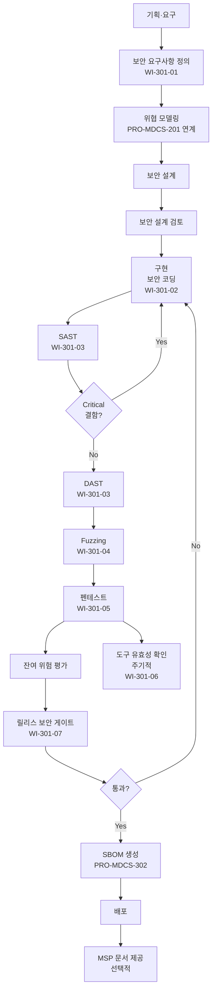

# 보안 개발수명주기(Secure SDLC) 절차 (PRO-MDCS-301)

> 상위 정책: [[POL-MDCS-003_보안_개발수명주기_정책_v1.0]]
> 연계: [[PRO-MDCS-201_사이버보안_리스크_관리_절차_v1.0]] (위협 모델링), [[PRO-MDCS-302_SBOM_관리_절차_v1.0]]

## 1. 목적

디지털의료기기 소프트웨어의 **요구 → 설계 → 구현 → 검증 → 릴리스** 단계에 **보안 게이트**를 배치하여, 보안 요구사항·보안 코딩·보안 테스트(SAST/DAST/Fuzzing/Pentest)·도구 유효성이 체계적으로 수행·증빙되도록 한다.

## 2. 적용 범위

- 신규 제품 및 기능 개정 릴리스의 **전체 SDLC**
- AI 적용 기기의 경우 AI 특화 테스트(데이터 오염·모델 회피 공격) 포함 — [[PRO-MDCS-201_사이버보안_리스크_관리_절차_v1.0]] 연계
- 자사 개발 코드 + **제3자·오픈소스** 구성요소 검증

## 3. 역할과 책임 (RACI)

| 단계 | PM | R&D | PSO | QA | 오동석 | VP R&D |
|---|---|---|---|---|---|---|
| 보안 요구사항 정의 | **A** | **R** | C | C | I | I |
| 위협 모델링 (설계) | C | **R** | **A** | C | I | I |
| 보안 설계 검토 | C | **R** | **A** | C | I | I |
| 보안 코딩·SAST | - | **R** | C | **A** | I | I |
| DAST·퍼징·펜테스트 | - | C | C | **R** | **A** | I |
| 도구 유효성 확인 | - | C | C | **R** | **A** | I |
| 릴리스 보안 게이트 | C | C | **A** | **R** | **A** | **A** |

## 4. 절차 흐름



## 5. 단계별 상세

| # | 단계 | 설명 | 담당 | 입력 | 출력 |
|---|---|---|---|---|---|
| 1 | 보안 요구사항 정의 | Security by Design 원칙 기반, 임상 안전·규제 요구 반영 | PM + R&D | 제품 요구 | 보안 요구사항 정의서 |
| 2 | 위협 모델링 | STRIDE 등 체계적 위협 모델링 (PRO-MDCS-201 에서 상세) | R&D + PSO | 아키텍처 | 위협 모델링 보고서 |
| 3 | 보안 설계 | 암호화·접근통제·입력검증·무결성 등 설계 반영 | R&D | 위협 모델링 | 보안 설계서 |
| 4 | 설계 검토 | PSO 주도 게이트 리뷰 | PSO | 설계서 | 검토 승인 기록 |
| 5 | 보안 코딩 | 보안 코딩 표준 적용, 안전 언어·라이브러리·샘플 사용 | R&D | 표준·설계서 | 코드 + 커밋 로그 |
| 6 | SAST | 정적 분석, Critical 결함 출시 차단 | QA | 코드 | SAST 리포트 |
| 7 | DAST | 동적 분석, 실행 환경 취약점 탐지 | QA | 빌드 | DAST 리포트 |
| 8 | Fuzzing | 퍼징 테스트, 비정상 입력·버퍼 처리 | QA | 빌드 | 퍼징 리포트 |
| 9 | 펜테스트 | 내·외부 모의 침투 테스트 | QA (+외부) | 빌드 | 펜테스트 리포트 |
| 10 | 도구 유효성 확인 | 테스트 도구 유효성·결과 해석 교육 (정기) | QA | 도구 명세 | 유효성 보고서 |
| 11 | 잔여 위험 평가 | 미조치 취약점의 잔여 위험 평가 | PSO | 테스트 결과 | 잔여 위험 보고서 |
| 12 | 릴리스 보안 게이트 | 모든 산출물 완비·통과 시 출시 승인 | PSO + QA + VP R&D | 산출물 패키지 | 릴리스 승인 |
| 13 | MSP 문서 제공 | 보안 요구정의서·위협 모델링·설계·테스트 결과·취약점 조치 내역 (선택 실행) | PM | 출시 패키지 | 제공 기록 |

## 6. 연계 업무지침 (WI)

- [[WI-301-01_보안_요구사항_정의_v0.1]]
- [[WI-301-02_보안_코딩_표준_v0.1]] — OWASP Top 10 대응 포함
- [[WI-301-03_SAST_DAST_운영_v0.1]]
- [[WI-301-04_Fuzzing_퍼징_v0.1]]
- [[WI-301-05_모의_침투_테스트_v0.1]]
- [[WI-301-06_도구_유효성_확인_v0.1]]
- [[WI-301-07_릴리스_보안_게이트_v0.1]]

## 7. 통제점 / KPI

| 통제점 | 지표 | 목표 | 주기 |
|---|---|---|---|
| 출시 차단 Critical 결함 | SAST/DAST Critical 잔존 | 0건 | 릴리스 |
| 펜테스트 커버리지 | 주요 유스케이스 커버율 | ≥ 90% | 릴리스 |
| 도구 유효성 점검 | 주기적 수행 | 반기 1회 | 반기 |
| 보안 게이트 우회 | 예외 릴리스 건 | 0건 (또는 PSC 승인 기록) | 분기 |
| MSP 문서 제공률 | 요청 대비 제공 | ≥ 95% | 분기 |

## 8. 표준 매핑 (Traceability)

| 표준 조항 | Req-ID | 반영 위치 |
|---|---|---|
| SaMD-CSMS 제14조 제1호 (보안 요구·설계·테스트) | MDCS-R-141 | §5 단계 1~7 |
| SaMD-CSMS 제14조 제2호 (SAST/DAST/Fuzzing/Pentest) | MDCS-R-142 | §5 단계 6~9 |
| SaMD-CSMS 제14조 제3호 (도구 유효성·교육) | MDCS-R-143 | §5 단계 10 |
| SaMD-CSMS 제14조 제4호 (MSP 문서 제공) | MDCS-R-144 | §5 단계 13 |
| SaMD-CSMS 제06조 제1호 (보안 코딩·보안 설계·보안 테스트) | MDCS-R-061 | §5 단계 3, 5, 7~9 |
| SaMD-CSMS 제13조 제3호 (통제 조치 구현) | MDCS-R-133 | §5 전체 |

## 9. 출처 (source_citation)

```yaml
- type: guide
  file: "_inputs/01_표준원문/제14조 개발 및 검증 활동.pdf"
  locator: "p.39"
  retrieved_at: "2026-04-17"
  license: "공공저작물 추정 — 확인 필요"
  paraphrase_only: true
- type: guide
  file: "_inputs/01_표준원문/제06조 기술적 보안.pdf"
  locator: "pp.22-23 §1"
  retrieved_at: "2026-04-17"
  license: "공공저작물 추정 — 확인 필요"
  paraphrase_only: true
- type: guide
  file: "_inputs/01_표준원문/제13조 위험 관리 활동.pdf"
  locator: "p.37 §3"
  retrieved_at: "2026-04-17"
  license: "공공저작물 추정 — 확인 필요"
  paraphrase_only: true
```

## 10. 개정 이력

| 버전 | 일자 | 변경내용 | 승인자 |
|---|---|---|---|
| 1.0 | 2026-04-17 | 최초 제정 (SaMD-CSMS 제14조 중심) | VP of R&D |
