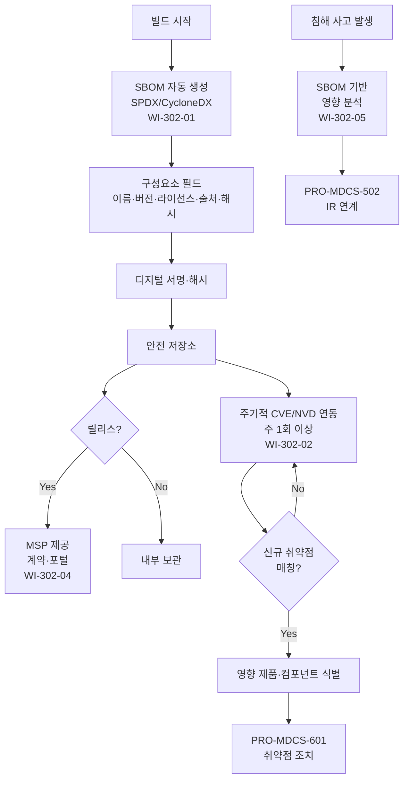

# SBOM(소프트웨어 구성요소 명세서) 관리 절차 (PRO-MDCS-302)

> 상위 정책: [[POL-MDCS-003_보안_개발수명주기_정책_v1.0]]

## 1. 목적

디지털의료기기의 **소프트웨어 구성요소 투명성**을 확보하고, **알려진 취약점(CVE/NVD) 과 연동**하여 영향 받는 제품·컴포넌트를 신속히 식별·조치하며, 침해 사고 시 공격 벡터 분석에 활용하기 위한 SBOM 관리 절차를 정의한다.

## 2. 적용 범위

- 본 표준 제16조의 모든 항목은 **선택 실행 지침(recommended)** 이나, 국제 동향(FDA·CISA·EU)에 따라 **사실상 의무**로 운영한다 (POL-MDCS-003 §5).
- 모든 릴리스(신규·개정) 의 SBOM
- 자사 개발 + **제3자·오픈소스** 구성요소
- 내부 빌드 시스템 및 의료서비스제공자(MSP)에 대한 외부 제공

## 3. 역할과 책임 (RACI)

| 단계 | SBOM 관리자 | R&D | PSO | CISO | 법무 | MSP |
|---|---|---|---|---|---|---|
| SBOM 생성 | **R** | C | **A** | I | - | - |
| 구성요소 정확성 검증 | **R** | **R** | A | - | - | - |
| CVE/NVD 연동 | **R** | C | **A** | I | - | - |
| SBOM 보호 (서명·저장) | **R** | C | A | **A** | - | - |
| MSP 제공 (계약·포털) | C | - | C | A | **R** | I |
| 침해 대응 활용 | **R** | C | **R** | A | - | - |

## 4. 절차 흐름



## 5. 단계별 상세

| # | 단계 | 설명 | 담당 | 입력 | 출력 |
|---|---|---|---|---|---|
| 1 | SBOM 생성 | 빌드 파이프라인에서 SPDX 또는 CycloneDX 포맷으로 자동 생성 | SBOM 관리자 | 빌드 아티팩트 | SBOM 파일 |
| 2 | 필드 확인 | 구성요소명·버전·라이선스·출처·해시 필드 충족 확인 | SBOM 관리자 | SBOM | 검증 로그 |
| 3 | 서명·보호 | 디지털 서명·암호화·보안 저장소 저장, 접근통제 강화 | SBOM 관리자 | SBOM | 서명된 SBOM |
| 4 | 제공 절차 | 계약 또는 포털을 통한 MSP 제공, 구매·설치 이전 확인 지원 | 법무 + SBOM | 요청 | 제공 기록 |
| 5 | CVE/NVD 연동 | 주 1회 이상 조회, SBOM 자동 매칭 | SBOM 관리자 | 최신 CVE 피드 | 매칭 리포트 |
| 6 | 영향 식별 | 매칭 시 영향 받는 제품·컴포넌트·버전 식별 | SBOM + PSO | 매칭 리포트 | 영향 분석 |
| 7 | 조치 연계 | PRO-MDCS-601 에 패치·업데이트 요청 | PSO | 영향 분석 | 티켓 |
| 8 | 침해 대응 활용 | 침해 발생 시 SBOM 기반으로 공격 벡터·영향 제품군 신속 식별 | SBOM + CSIRT | 침해 정보 | 영향 분석 |

## 6. 연계 업무지침 (WI)

- [[WI-302-01_SBOM_생성_및_포맷_v0.1]] — SPDX/CycloneDX
- [[WI-302-02_CVE_NVD_연동_v0.1]] — 주기적 조회
- [[WI-302-03_SBOM_보호_보안통신_저장_v0.1]] — 서명·암호화·접근통제
- [[WI-302-04_SBOM_MSP_제공_계약_포털_v0.1]] — 외부 제공
- [[WI-302-05_SBOM_침해대응_연계_v0.1]] — IR 연계

## 7. 통제점 / KPI

| 통제점 | 지표 | 목표 | 주기 |
|---|---|---|---|
| SBOM 생성률 | 릴리스 중 SBOM 동반 | 100% | 릴리스 |
| 필드 완결성 | 필수 5개 필드 충족 | 100% | 릴리스 |
| CVE 매칭 주기 | 조회 간격 | ≤ 주 1회 | 주 |
| CVE 매칭→조치 티켓 발행 | 리드타임 | ≤ 3 영업일 | 월 |
| MSP 제공 요청 SLA | 요청→제공 | ≤ 5 영업일 | 분기 |

## 8. 표준 매핑 (Traceability)

| 표준 조항 | Req-ID | 반영 위치 |
|---|---|---|
| SaMD-CSMS 제16조 제1호 (SBOM 구성·활용) | MDCS-R-161 | §5 단계 1~2 |
| SaMD-CSMS 제16조 제2호 (CVE 연동·패치) | MDCS-R-162 | §5 단계 5~7 |
| SaMD-CSMS 제16조 제3호 (MSP 제공) | MDCS-R-163 | §5 단계 4 |
| SaMD-CSMS 제16조 제4호 (SBOM 보호·암호화·서명) | MDCS-R-164 | §5 단계 3 |
| SaMD-CSMS 제16조 제5호 (침해 대응 연계) | MDCS-R-165 | §5 단계 8 |
| SaMD-CSMS 제17조 제4호 (SBOM 기반 영향 식별) | MDCS-R-174 | §5 단계 8 |

## 9. 출처 (source_citation)

```yaml
- type: guide
  file: "_inputs/01_표준원문/제16조 소프트웨어 구성요소 명세서(SBOM) 관리 활동.pdf"
  locator: "pp.42-43"
  retrieved_at: "2026-04-17"
  license: "공공저작물 추정 — 확인 필요"
  paraphrase_only: true
- type: guide
  file: "_inputs/01_표준원문/제17조 침해행위 대응 계획 등.pdf"
  locator: "p.44 §4"
  retrieved_at: "2026-04-17"
  license: "공공저작물 추정 — 확인 필요"
  paraphrase_only: true
```

## 10. 개정 이력

| 버전 | 일자 | 변경내용 | 승인자 |
|---|---|---|---|
| 1.0 | 2026-04-17 | 최초 제정 (SaMD-CSMS 제16조 기반, 제17조 연계) | CISO |
