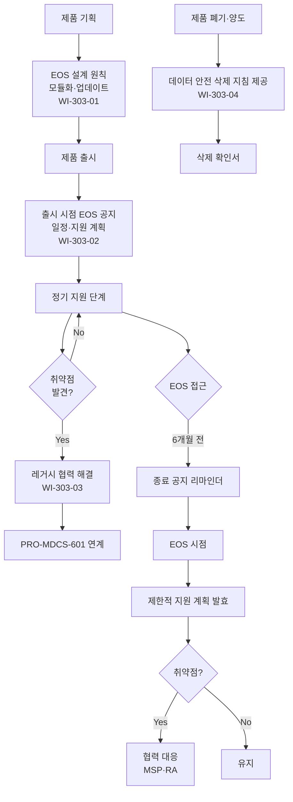

# 레거시 디지털의료기기 관리 절차 (PRO-MDCS-303)

> 상위 정책: [[POL-MDCS-003_보안_개발수명주기_정책_v1.0]]

## 1. 목적

디지털의료기기의 **지원 종료(EOS) 이후에도 보안 위험이 최소화**되도록 설계부터 공지·협력·폐기까지 레거시 관리 라이프사이클을 정의한다.

## 2. 적용 범위

- 신규 제품의 **EOS 설계 원칙**(모듈화·업데이트 메커니즘·서드파티 종속 최소화)
- **지원 종료 일정 및 제한적 지원 계획**의 문서화·의료서비스제공자 공지
- **레거시 단계**에서 발견된 취약점의 협력 해결
- 제품 **폐기·양도** 시 개인정보 등 안전 삭제 지침 제공

## 3. 역할과 책임 (RACI)

| 단계 | PM | R&D | PSO | Legal/RA | MSP | DPO |
|---|---|---|---|---|---|---|
| EOS 설계 원칙 반영 | **A** | **R** | C | - | - | - |
| EOS 일정·지원 계획 문서화 | **R** | C | A | C | I | - |
| EOS 공지 | **R** | - | C | **A** | I | - |
| 레거시 취약점 협력 해결 | C | **R** | **A** | C | I | - |
| 폐기·양도 지침 제공 | C | C | C | **A** | I | **R** |

## 4. 절차 흐름



## 5. 단계별 상세

| # | 단계 | 설명 | 담당 | 입력 | 출력 |
|---|---|---|---|---|---|
| 1 | EOS 설계 원칙 | 모듈화·업데이트 메커니즘·서드파티 종속 최소화 설계 | R&D | 제품 요구 | 설계 문서 |
| 2 | EOS 일정 공지 (출시 시) | 예상 지원 종료 일정 및 EOS 이후 예상 지원 계획 문서화 | PM + RA | 제품 출시 | EOS 공지서 (TMP) |
| 3 | 지원 단계 운영 | 정기 패치·보안 업데이트 지원, 취약점 대응 | R&D + PSO | 취약점 | PRO-MDCS-601 연계 |
| 4 | 레거시 협력 해결 | 수명 종료 단계 취약점에 대해 MSP 와 협력, 위험 관리·제품·컴포넌트 패치·보안 문서 마련 | PSO + R&D | 취약점 정보 | 협력 조치 보고 |
| 5 | EOS 접근 알림 | EOS 6개월 전 리마인더 공지 | PM + RA | EOS 일정 | 공지 이력 |
| 6 | EOS 발효 후 지원 | 제한적 지원(보안 패치 우선)·MSP 협력 창구 유지 | PSO | EOS 계획 | 레거시 지원 기록 |
| 7 | 폐기·양도 시 데이터 삭제 | 개인정보 등 영구 삭제 절차·도구 지침 제공 | DPO + PM | 요청 | TMP-데이터삭제지침 |

## 6. 연계 업무지침 (WI)

- [[WI-303-01_EOS_설계_원칙_v0.1]] — 모듈화·업데이트
- [[WI-303-02_EOS_일정_지원계획_공지_v0.1]] — 공지 양식·채널
- [[WI-303-03_레거시_취약점_패치_협력_v0.1]] — 제15·22조 연계
- [[WI-303-04_폐기_및_데이터_안전삭제_v0.1]] — 영구 삭제 지침

## 7. 통제점 / KPI

| 통제점 | 지표 | 목표 | 주기 |
|---|---|---|---|
| 출시 시 EOS 공지 완결성 | 공지서 포함 제품 비율 | 100% | 릴리스 |
| EOS 6개월 전 리마인더 | 공지 준수율 | 100% | 분기 |
| 레거시 취약점 대응 | 협력 조치 리드타임 | ≤ 60일 (Critical 기준) | 사건별 |
| 폐기 시 데이터 삭제 지침 제공 | 요청 대비 제공 | 100% | 분기 |
| MSP 공지 접수 확인률 | 공지 수신 확인 | ≥ 95% | 분기 |

## 8. 표준 매핑 (Traceability)

| 표준 조항 | Req-ID | 반영 위치 |
|---|---|---|
| SaMD-CSMS 제15조 제1호 (EOS 설계) | MDCS-R-151 | §5 단계 1 |
| SaMD-CSMS 제15조 제2호 (EOS 일정·지원 계획 공지) | MDCS-R-152 | §5 단계 2, 5 |
| SaMD-CSMS 제15조 제3호 (레거시 협력 해결) | MDCS-R-153 | §5 단계 4 |
| SaMD-CSMS 제15조 제4호 (폐기·데이터 삭제) | MDCS-R-154 | §5 단계 7 |
| SaMD-CSMS 제22조 제2호 (레거시 패치) | MDCS-R-222 | §5 단계 4 (PRO-MDCS-601 연계) |

## 9. 출처 (source_citation)

```yaml
- type: guide
  file: "_inputs/01_표준원문/제15조 레거시 디지털의료기기 관리 활동.pdf"
  locator: "pp.40-41"
  retrieved_at: "2026-04-17"
  license: "공공저작물 추정 — 확인 필요"
  paraphrase_only: true
- type: guide
  file: "_inputs/01_표준원문/제22조 취약점 조치.pdf"
  locator: "p.55 §2"
  retrieved_at: "2026-04-17"
  license: "공공저작물 추정 — 확인 필요"
  paraphrase_only: true
```

## 10. 개정 이력

| 버전 | 일자 | 변경내용 | 승인자 |
|---|---|---|---|
| 1.0 | 2026-04-17 | 최초 제정 (SaMD-CSMS 제15조 기반, 제22조 레거시 패치 연계) | VP of R&D |
