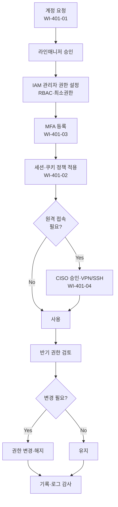

# 접근통제 및 인증 관리 절차 (PRO-MDCS-401)

> 상위 정책: [[POL-MDCS-004_기술적_물리적_보안통제_정책_v1.0]]

## 1. 목적

디지털의료기기 및 운영 환경의 **사용자·서비스 계정 생명주기**를 통제하고, **MFA·세션·원격 접속** 등 인증 수단을 일관되게 운영하여 비인가 접근과 계정 탈취를 예방한다.

## 2. 적용 범위

- 당사 임직원, 외주·협력사, 의료서비스제공자(MSP) 운영 인력 등 **모든 인적 계정**
- API 키·서비스 계정·장치 인증서 등 **비인적 계정**
- 운영 환경에 대한 **로컬·네트워크·원격 접속**
- 세션·쿠키·MFA·로그인 실패 잠금 등 **인증 메커니즘**

## 3. 역할과 책임 (RACI)

| 단계 | 요청자 | 라인매니저 | IAM 관리자 | 시스템 소유자 | CISO |
|---|---|---|---|---|---|
| 계정 생성 요청 | **R** | **A** | C | I | - |
| 권한 부여 (RBAC) | - | C | **R** | **A** | I |
| 권한 변경·해지 | **R** | **A** | **R** | C | - |
| 권한 주기 검토 (반기) | - | C | **R** | C | **A** |
| MFA·패스워드 정책 설정 | - | - | **R** | C | **A** |
| 원격 접속 허용 심의 | R | C | C | C | **A** |
| 로그·감사 | - | - | **R** | C | A |

## 4. 절차 흐름



## 5. 단계별 상세

| # | 단계 | 설명 | 담당 | 입력 | 출력 |
|---|---|---|---|---|---|
| 1 | 계정 요청 | 권한 신청서 제출 (사유·직무·기간) | 요청자 | 권한 신청서 | 접수번호 |
| 2 | 승인 | 라인매니저가 업무 필요성 검토·승인 | 라인매니저 | 신청서 | 승인 기록 |
| 3 | 권한 설정 | RBAC·최소권한 원칙으로 역할 배정 | IAM 관리자 | 승인 | 권한 부여 기록 |
| 4 | MFA 등록 | 다단계 인증 수단 등록·테스트 | 요청자/IAM | 계정 | MFA 활성화 |
| 5 | 세션·쿠키 | Idle Timeout, 중복 로그인 방지, Secure/HttpOnly 설정 | 시스템 소유자 | 시스템 | 정책 적용 로그 |
| 6 | 원격 접속 심의 | 기본 차단, 필요 시 MFA·IP 제한·허용 시간 명시하여 CISO 승인 | CISO | 원격 접속 요청 | 승인 기록 |
| 7 | 권한 검토 | 반기별 전 계정 권한 검토, 불용 계정 비활성화 | IAM 관리자 | 계정 목록 | 검토 보고서 |
| 8 | 로그·감사 | 로그인·실패·권한 변경 로그 보관·분석 | IAM 관리자 | 로그 | 감사 리포트 |

## 6. 연계 업무지침 (WI)

- [[WI-401-01_계정_생명주기_v0.1]] — 생성·변경·삭제
- [[WI-401-02_세션_및_쿠키_관리_v0.1]] — Idle Timeout, Secure/HttpOnly
- [[WI-401-03_MFA_및_패스워드_정책_v0.1]] — 인증 수단·잠금
- [[WI-401-04_원격접속_관리_v0.1]] — VPN/SSH·IP 제한

## 7. 통제점 / KPI

| 통제점 | 지표 | 목표 | 주기 |
|---|---|---|---|
| MFA 적용률 | 관리자·특권 계정 중 MFA 활성 | 100% | 월 |
| 미승인 권한 변경 | 정식 절차 外 권한 변경 | 0건 | 분기 |
| 권한 검토 수행률 | 반기 대상 계정 검토 | 100% | 반기 |
| 불용 계정 비율 | 90일 미사용 계정 | ≤ 1% | 월 |
| 원격 접속 이력 누락 | 접속 로그 미기록 | 0건 | 월 |

## 8. 표준 매핑 (Traceability)

| 표준 조항 | Req-ID | 반영 위치 |
|---|---|---|
| SaMD-CSMS 제05조 제1호 (RBAC·최소권한·생명주기) | MDCS-R-051 | §4, §5 단계 1~3, §5 단계 7 |
| SaMD-CSMS 제05조 제2호 (세션·쿠키) | MDCS-R-052 | §5 단계 5 |
| SaMD-CSMS 제05조 제3호 (MFA·강력 패스워드·잠금) | MDCS-R-053 | §5 단계 4 |
| SaMD-CSMS 제05조 제4호 (원격 접속 제한) | MDCS-R-054 | §5 단계 6 |
| ISO/IEC 27001 A.5.15-18 | — | §1~§5 |

## 9. 출처 (source_citation)

```yaml
- type: guide
  file: "_inputs/01_표준원문/제05조 권한 및 인증.pdf"
  locator: "pp.20-21"
  retrieved_at: "2026-04-17"
  license: "공공저작물 추정 — 확인 필요"
  paraphrase_only: true
```

## 10. 개정 이력

| 버전 | 일자 | 변경내용 | 승인자 |
|---|---|---|---|
| 1.0 | 2026-04-17 | 최초 제정 (SaMD-CSMS 제05조 기반) | CISO |
