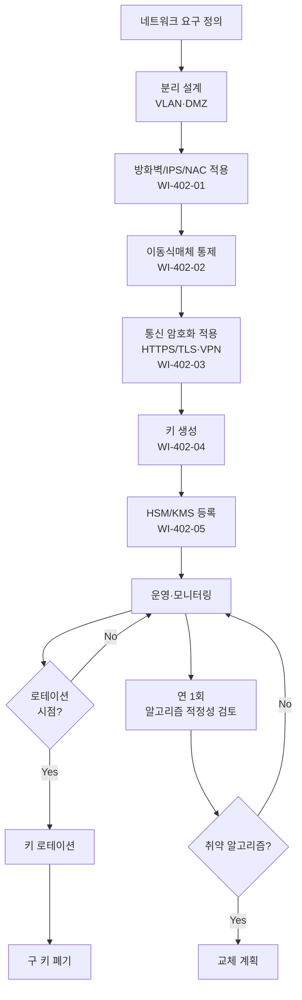

# 보안 통신 및 암호화 관리 절차 (PRO-MDCS-402)

> 상위 정책: [[POL-MDCS-004_기술적_물리적_보안통제_정책_v1.0]]

## 1. 목적

디지털의료기기와 운영 환경 간의 **유·무선 통신을 안전하게 설정**하고, **업계 표준 암호 알고리즘**으로 통신·저장 데이터를 보호하며, **암호화 키의 생명주기**를 통제하여 데이터 유출·가로채기·키 노출을 예방한다.

## 2. 적용 범위

- 유·무선 네트워크 구성(VLAN, 방화벽, IPS, NAC, WPA3 이상)
- 내·외부 통신 암호화(HTTPS/TLS, VPN, IPsec, SSH)
- 이동식 저장매체(USB 등) 통제
- 암호화 키 생성·로테이션·백업·폐기, HSM/TPM/KMS 운영

## 3. 역할과 책임 (RACI)

| 단계 | 네트워크팀 | 인프라팀 | KMS Admin | CISO | SecOps |
|---|---|---|---|---|---|
| 네트워크 보안 설계 | **R** | C | - | **A** | I |
| 방화벽/IPS 운영 | **R** | C | - | A | C |
| 이동식매체 통제 | C | **R** | - | A | C |
| TLS/VPN 인증서 관리 | C | **R** | C | A | C |
| 암호키 생성·로테이션 | - | C | **R** | **A** | I |
| HSM/KMS 운영 | - | C | **R** | A | I |
| 알고리즘 적정성 검토 (연) | - | C | **R** | **A** | C |

## 4. 절차 흐름



## 5. 단계별 상세

| # | 단계 | 설명 | 담당 | 입력 | 출력 |
|---|---|---|---|---|---|
| 1 | 네트워크 분리 설계 | VLAN·DMZ·의료기기 전용 세그먼트 설계 | 네트워크팀 | 아키텍처 | 네트워크 도면 |
| 2 | 방화벽·IPS·NAC | 포트 보안, WPA3, MAC 필터링 적용 | 네트워크팀 | 도면 | 적용 기록 |
| 3 | 이동식 매체 통제 | 포트 비활성화/봉인, 화이트리스트, 전송절차 | 인프라팀 | 정책 | 매체 대장 |
| 4 | 통신 암호화 | HTTPS/TLS, VPN/IPsec, SSH 적용; 약한 암호 비활성 | 인프라팀 | 인증서 | 암호화 구성 |
| 5 | 알고리즘 선택 | AES-256, SHA-256/512 등 업계 표준; DES·MD5·SHA-1 금지 | KMS Admin | 정책 | 알고리즘 목록 |
| 6 | 키 생명주기 | 생성·유효기간·로테이션·백업·복구 계획 수립 | KMS Admin | 정책 | 키 인벤토리 |
| 7 | HSM/KMS 운영 | HSM/TPM/KMS 설치, 보안 부팅·펌웨어 무결성 검증 | KMS Admin | 장비 | 운영 로그 |
| 8 | 키 접근 통제 | 최소권한·MFA 기반 접근 | KMS Admin | 키 인벤토리 | 접근 로그 |
| 9 | 알고리즘 적정성 검토 | 연 1회 안전성 검토, 취약 알고리즘 교체 | KMS Admin | 산업 동향 | 검토 보고서 |

## 6. 연계 업무지침 (WI)

- [[WI-402-01_네트워크_보안_설정_v0.1]] — 방화벽·IPS·NAC
- [[WI-402-02_이동식매체_통제_v0.1]] — USB 포트·화이트리스트
- [[WI-402-03_통신_암호화_v0.1]] — TLS·VPN 설정
- [[WI-402-04_암호키_수명주기_v0.1]] — 키 생성·로테이션
- [[WI-402-05_HSM_KMS_운영_v0.1]] — HSM/TPM/KMS

## 7. 통제점 / KPI

| 통제점 | 지표 | 목표 | 주기 |
|---|---|---|---|
| 취약 알고리즘 사용 | DES/MD5/SHA-1 탐지 | 0건 | 분기 |
| TLS 인증서 만료 사전 알림 | 30일 전 알림 | 100% | 월 |
| 키 로테이션 SLA 준수 | 기한 내 로테이션 | ≥ 98% | 분기 |
| HSM 가용성 | 가동률 | ≥ 99.9% | 월 |
| 미통제 이동식 매체 탐지 | NAC·EDR 탐지 건수 | 감소 추세 | 월 |

## 8. 표준 매핑 (Traceability)

| 표준 조항 | Req-ID | 반영 위치 |
|---|---|---|
| SaMD-CSMS 제04조 제1호 (네트워크 보안 설정) | MDCS-R-041 | §5 단계 1~2 |
| SaMD-CSMS 제04조 제2호 (이동식매체) | MDCS-R-042 | §5 단계 3 |
| SaMD-CSMS 제04조 제3호 (통신 암호화) | MDCS-R-043 | §5 단계 4 |
| SaMD-CSMS 제09조 제1호 (키·데이터 분리·로테이션) | MDCS-R-091 | §5 단계 6 |
| SaMD-CSMS 제09조 제2호 (키 접근·백업) | MDCS-R-092 | §5 단계 8 |
| SaMD-CSMS 제09조 제3호 (HSM/TPM/KMS·보안부팅) | MDCS-R-093 | §5 단계 7 |

## 9. 출처 (source_citation)

```yaml
- type: guide
  file: "_inputs/01_표준원문/제04조 보안 통신.pdf"
  locator: "pp.18-19"
  retrieved_at: "2026-04-17"
  license: "공공저작물 추정 — 확인 필요"
  paraphrase_only: true
- type: guide
  file: "_inputs/01_표준원문/제09조 암호화 키 관리.pdf"
  locator: "pp.28-29"
  retrieved_at: "2026-04-17"
  license: "공공저작물 추정 — 확인 필요"
  paraphrase_only: true
```

## 10. 개정 이력

| 버전 | 일자 | 변경내용 | 승인자 |
|---|---|---|---|
| 1.0 | 2026-04-17 | 최초 제정 (SaMD-CSMS 제04·09조 기반) | CISO |
