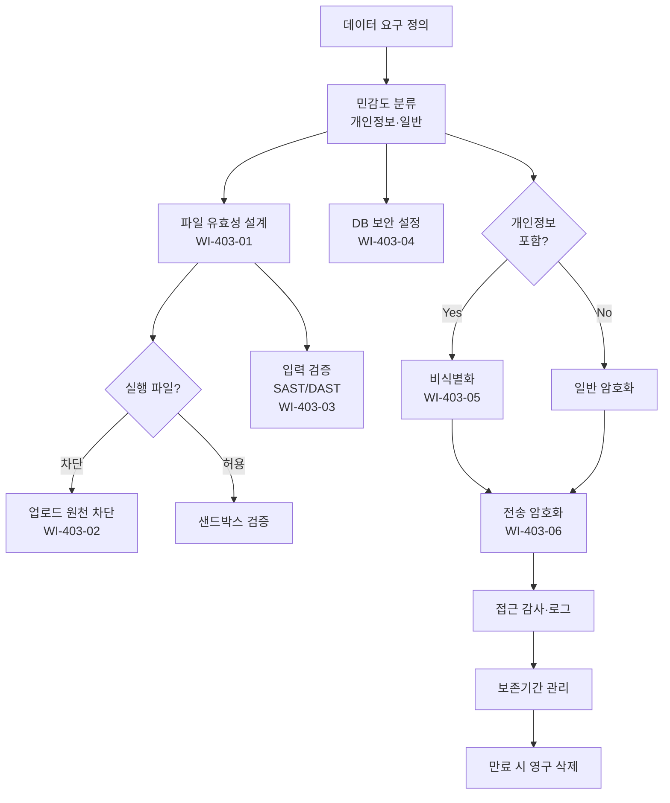

# 데이터 및 파일 보안 관리 절차 (PRO-MDCS-403)

> 상위 정책: [[POL-MDCS-004_기술적_물리적_보안통제_정책_v1.0]]

## 1. 목적

디지털의료기기가 처리하는 **파일·입력 데이터·DB·개인정보·전송 데이터**의 기밀성·무결성·가용성을 확보하고, 실행 파일 업로드·SQL Injection·XSS·버퍼 오버플로우·개인정보 유출을 예방한다.

## 2. 적용 범위

- 기기·서버·클라이언트에서 수행하는 **파일 업·다운로드**
- 사용자·외부 시스템으로부터의 **입력 데이터 처리**
- **데이터베이스** 운영 (계정·권한·백업)
- **개인정보 및 민감정보** 수집·저장·비식별화·폐기
- **시스템 간 데이터 송수신**

## 3. 역할과 책임 (RACI)

| 단계 | 개발팀 | QA | DBA | DPO | SecOps |
|---|---|---|---|---|---|
| 파일 검증 로직 설계 | **R** | C | - | C | A |
| 입력 검증 (SAST/DAST) | **R** | **A** | - | - | I |
| DB 보안 설정 | C | - | **R** | C | **A** |
| 비식별화 설계·운영 | C | - | C | **R** | A |
| 전송 암호화 적용 | **R** | C | C | C | **A** |
| 개인정보 접근 감사 | - | - | C | **R** | **A** |

## 4. 절차 흐름



## 5. 단계별 상세

| # | 단계 | 설명 | 담당 | 입력 | 출력 |
|---|---|---|---|---|---|
| 1 | 민감도 분류 | 개인정보·민감정보·일반 데이터 분류 | DPO | 데이터 목록 | 분류 태그 |
| 2 | 파일 업·다운로드 검증 | 확장자 화이트리스트·매직넘버·크기·AV 스캔·경로 조작 방지; 다운로드는 해시 비교 | 개발팀 | 업·다운로드 요구 | 검증 로직 |
| 3 | 실행 파일 차단 | .exe/.dll/.bat/.sh 업로드 원천 차단, 필요 시 샌드박스 | 개발팀 | 정책 | 차단 로직 |
| 4 | 입력 검증 | 길이·형식·타입·범위 검증; SQL Injection·XSS·BOF 방어; SAST/DAST 적용 | 개발팀/QA | 입력 스펙 | 검증 코드·SAST 리포트 |
| 5 | DB 보안 | 강력 패스워드·주기적 변경·미사용 관리자 계정 삭제·최소 권한 | DBA | DB 인스턴스 | 보안 설정 기록 |
| 6 | 개인정보 비식별화 | 가명·익명·총계·마스킹 조치 | DPO | 개인정보 | 비식별화 결과 |
| 7 | 전송 암호화 | HTTPS/TLS/VPN + 민감 데이터 자체 암호화(이중 보안) | 개발팀 | 전송 구간 | 암호화 기록 |
| 8 | 접근 감사 | 개인정보 접근 로그·이상 행위 탐지 | DPO/SecOps | 로그 | 감사 리포트 |
| 9 | 영구 삭제 | 보존기간 종료 시 복구 불가 삭제 | DPO | 보존 정책 | 삭제 증적 |

## 6. 연계 업무지침 (WI)

- [[WI-403-01_파일_업다운로드_검증_v0.1]] — 화이트리스트·AV·해시
- [[WI-403-02_실행파일_차단_v0.1]] — 원천 차단·샌드박스
- [[WI-403-03_입력_검증_및_SAST_v0.1]] — OWASP Top 10 대응
- [[WI-403-04_DB_보안_관리_v0.1]] — DB 계정·백업
- [[WI-403-05_개인정보_비식별화_v0.1]] — 가명·익명·마스킹
- [[WI-403-06_데이터_전송_암호화_v0.1]] — TLS + 자체 암호화

## 7. 통제점 / KPI

| 통제점 | 지표 | 목표 | 주기 |
|---|---|---|---|
| SAST High/Critical 결함 | 출시 차단 결함 건수 | 0건 (Critical), ≤ 3건 (High 완화 계획) | 릴리스 |
| 실행 파일 업로드 성공 | 테스트 시 차단 실패 | 0건 | 분기 |
| 개인정보 접근 이상 행위 | 이상 탐지 미분석 건수 | 0건 | 월 |
| DB 미사용 관리자 계정 | 탐지 후 90일 초과 | 0건 | 분기 |
| 비식별화 검증율 | 개인정보 처리 대비 비식별화 완료 비율 | 100% | 분기 |

## 8. 표준 매핑 (Traceability)

| 표준 조항 | Req-ID | 반영 위치 |
|---|---|---|
| SaMD-CSMS 제07조 제1호 (업로드 검증) | MDCS-R-071 | §5 단계 2 |
| SaMD-CSMS 제07조 제2호 (다운로드 해시) | MDCS-R-072 | §5 단계 2 |
| SaMD-CSMS 제07조 제3호 (실행 파일 차단) | MDCS-R-073 | §5 단계 3 |
| SaMD-CSMS 제07조 제4호 (입력 검증·SAST/DAST) | MDCS-R-074 | §5 단계 4 |
| SaMD-CSMS 제08조 제1호 (DB 보안) | MDCS-R-081 | §5 단계 5 |
| SaMD-CSMS 제08조 제2호 (비식별화) | MDCS-R-082 | §5 단계 6 |
| SaMD-CSMS 제08조 제3호 (전송 암호화·이중 보안) | MDCS-R-083 | §5 단계 7 |
| SaMD-CSMS 제08조 제4호 (표준 알고리즘·취약 금지) | MDCS-R-084 | §5 단계 7 (PRO-MDCS-402 연계) |
| SaMD-CSMS 제06조 제4호 (개인정보 암호화) | MDCS-R-064 | §5 단계 6~7 |

## 9. 출처 (source_citation)

```yaml
- type: guide
  file: "_inputs/01_표준원문/제07조 파일 및 입력 유효성.pdf"
  locator: "pp.24-25"
  retrieved_at: "2026-04-17"
  license: "공공저작물 추정 — 확인 필요"
  paraphrase_only: true
- type: guide
  file: "_inputs/01_표준원문/제08조 데이터 보안.pdf"
  locator: "pp.26-27"
  retrieved_at: "2026-04-17"
  license: "공공저작물 추정 — 확인 필요"
  paraphrase_only: true
- type: guide
  file: "_inputs/01_표준원문/제06조 기술적 보안.pdf"
  locator: "pp.22-23 §4 개인정보"
  retrieved_at: "2026-04-17"
  license: "공공저작물 추정 — 확인 필요"
  paraphrase_only: true
```

## 10. 개정 이력

| 버전 | 일자 | 변경내용 | 승인자 |
|---|---|---|---|
| 1.0 | 2026-04-17 | 최초 제정 (SaMD-CSMS 제06·07·08조 기반) | CISO |
