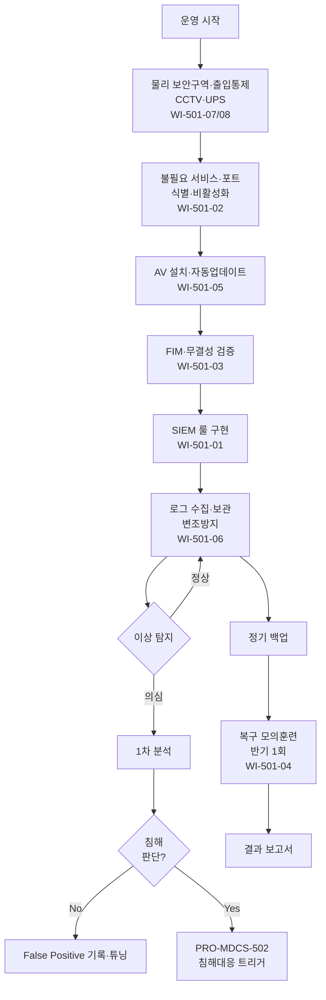

# 보안 모니터링 및 로그 관리 절차 (PRO-MDCS-501)

> 상위 정책: [[POL-MDCS-005_침해행위_대응_정책_v1.0]]

## 1. 목적

디지털의료기기 및 운영 환경에 대한 **이상 징후·비정상 접근·잠재 위협**을 상시 탐지하고, 로그를 변조 방지 상태로 보관·분석하며, 시스템 하드닝·무결성 검증·백업/복구 모의훈련과 **운영 환경의 물리 보안**(보안구역·출입통제·전산실 강화)을 일관되게 운영하여 침해행위를 조기에 차단·복구한다.

## 2. 적용 범위

- 운영 환경 컴퓨터·서버·네트워크 장비·클라우드 인프라
- 제품 기기 자체(운영 환경에서 접근 가능한 범위)
- 보안 관련 활동 로그·시스템 이벤트 로그·애플리케이션 로그
- 소스코드·주요 운영 데이터의 백업·복구
- **운영 환경의 물리 보안**: 보안구역 지정·CCTV·UPS·소화·방수·침입감지, 출입통제·출입기록, 전산실·서버실 이중 잠금·다단계 출입통제·항온항습·훼손방지

## 3. 역할과 책임 (RACI)

| 단계 | SecOps | 인프라팀 | 시설관리팀 | 개발팀 | CSIRT | 오동석 |
|---|---|---|---|---|---|---|
| 모니터링 룰 설계 | **R** | C | - | C | C | **A** |
| SIEM 운영 | **R** | C | - | - | I | A |
| 시스템 하드닝 | C | **R** | - | C | - | **A** |
| 무결성 검증 (FIM) | **R** | C | - | C | I | A |
| 백업 수행 | C | **R** | - | C | - | A |
| 복구 모의훈련 | **R** | **R** | - | C | C | **A** |
| AV 배포·업데이트 | C | **R** | - | - | - | A |
| 로그 분석·이상 대응 | **R** | C | - | - | **A** (사고 시) | A |
| 물리 보안구역·출입 운영 | C | C | **R** | - | - | **A** |
| 전산실 강화보안 | C | C | **R** | - | - | **A** |

## 4. 절차 흐름



## 5. 단계별 상세

| # | 단계 | 설명 | 담당 | 입력 | 출력 |
|---|---|---|---|---|---|
| 0 | 물리 보안구역·출입통제 | 보안구역 지정, CCTV, UPS, 소화·침입감지 설비, 인가자 출입기록 관리, 전산실 이중 잠금·다단계 출입·항온항습 | 시설관리팀 | 자산·시설 | 보안구역 대장·출입 기록 |
| 1 | 공격 표면 최소화 | 불필요 서비스·포트·인터페이스 식별·비활성화, 하드닝 기준 적용 | 인프라팀 | 자산 목록 | 하드닝 결과 |
| 2 | AV 설치·운영 | 최신 AV 설치, 자동 업데이트, 정기 스캔 | 인프라팀 | 자산 | AV 상태 리포트 |
| 3 | 무결성 검증 | FIM·해시·서명 기반 상시 검증, 변경 알림 | SecOps | 주요 파일 | FIM 알림·리포트 |
| 4 | SIEM 룰 구현 | 이상 접근·로그인 실패·멀웨어 패턴·DLP 룰 | SecOps | 위협 인텔 | 탐지 룰 |
| 5 | 로그 수집·보관 | 보안·시스템·AP 이벤트 로그 수집, 변조 방지 보관 | SecOps | 로그원 | 로그 저장소 |
| 6 | 로그 분석 | 정기 분석·이상 탐지·SOAR 플레이북 실행 | SecOps | 로그 | 분석 리포트 |
| 7 | 침해 에스컬레이션 | 의심 탐지 시 PRO-MDCS-502 으로 에스컬레이션 | SecOps → CSIRT | 분석 결과 | IR 티켓 |
| 8 | 백업 | 소스코드·운영 데이터 정기 백업, 오프사이트 보관 | 인프라팀 | 데이터 | 백업 로그 |
| 9 | 복구 모의훈련 | 반기 1회 이상 복구 훈련, 결과 문서화 | SecOps | 백업 | 훈련 보고서 |

## 6. 연계 업무지침 (WI)

- [[WI-501-01_SIEM_운영_v0.1]] — 탐지 룰·플레이북
- [[WI-501-02_시스템_하드닝_v0.1]] — 공격 표면 최소화
- [[WI-501-03_무결성_검증_FIM_v0.1]] — FIM·해시·서명
- [[WI-501-04_백업_복구_모의훈련_v0.1]] — 백업·복구
- [[WI-501-05_안티바이러스_운영_v0.1]] — AV 배포·업데이트
- [[WI-501-06_로그_관리_및_분석_v0.1]] — 수집·보관·분석
- [[WI-501-07_물리_보안구역_출입통제_v0.1]] — 보안구역·CCTV·출입기록
- [[WI-501-08_전산실_강화보안_v0.1]] — 이중 잠금·항온항습·훼손방지

## 7. 통제점 / KPI

| 통제점 | 지표 | 목표 | 주기 |
|---|---|---|---|
| 탐지 MTTD (Mean Time To Detect) | 이상 발생→탐지 | ≤ 60분 | 월 |
| SIEM 룰 커버리지 | 주요 위협 카테고리 커버 | ≥ 90% | 분기 |
| 백업 성공률 | 예정 대비 성공 | ≥ 99.5% | 월 |
| 복구 모의훈련 수행 | 반기당 1회 | 100% | 반기 |
| AV 최신 패턴 적용률 | 단말 중 최신 | ≥ 99% | 월 |
| 비인가 출입 시도 | CCTV/NAC 탐지 후 미조치 | 0건 | 월 |

## 8. 표준 매핑 (Traceability)

| 표준 조항 | Req-ID | 반영 위치 |
|---|---|---|
| SaMD-CSMS 제11조 제1호 (불필요 서비스·이상 탐지) | MDCS-R-111 | §5 단계 1, 4 |
| SaMD-CSMS 제11조 제2호 (백업·복구·모의훈련) | MDCS-R-112 | §5 단계 8, 9 |
| SaMD-CSMS 제11조 제3호 (안티바이러스) | MDCS-R-113 | §5 단계 2 |
| SaMD-CSMS 제11조 제4호 (로그 기록·변조방지·분석) | MDCS-R-114 | §5 단계 5, 6 |
| SaMD-CSMS 제11조 제5호 (MSP 모니터링·통보) | MDCS-R-115 | §4 역할 (선택 실행) |
| SaMD-CSMS 제06조 제2호 (시스템 강화) | MDCS-R-062 | §5 단계 1 |
| SaMD-CSMS 제06조 제3호 (무결성 검증) | MDCS-R-063 | §5 단계 3 |
| SaMD-CSMS 제10조 제3호 (정기 무결성 검증) | MDCS-R-103 | §5 단계 3 |
| SaMD-CSMS 제03조 제1호 (물리보안 대책·문서화) | MDCS-R-031 | §2 적용 범위, §5 단계 0 |
| SaMD-CSMS 제03조 제2호 (CCTV·UPS·소화·침입감지) | MDCS-R-032 | §5 단계 0 |
| SaMD-CSMS 제03조 제3호 (출입통제·인가·주기 검토) | MDCS-R-033 | §5 단계 0 |
| SaMD-CSMS 제03조 제4호 (전산실 강화보안) | MDCS-R-034 | §5 단계 0 (WI-501-08) |

## 9. 출처 (source_citation)

```yaml
- type: guide
  file: "_inputs/01_표준원문/제11조 보안 모니터링 및 대응.pdf"
  locator: "pp.32-34"
  retrieved_at: "2026-04-17"
  license: "공공저작물 추정 — 확인 필요"
  paraphrase_only: true
- type: guide
  file: "_inputs/01_표준원문/제06조 기술적 보안.pdf"
  locator: "pp.22-23 §2,§3"
  retrieved_at: "2026-04-17"
  license: "공공저작물 추정 — 확인 필요"
  paraphrase_only: true
- type: guide
  file: "_inputs/01_표준원문/제10조 유지 관리.pdf"
  locator: "p.31 §3"
  retrieved_at: "2026-04-17"
  license: "공공저작물 추정 — 확인 필요"
  paraphrase_only: true
- type: guide
  file: "_inputs/01_표준원문/제03조 물리적 보안.pdf"
  locator: "pp.16-17"
  retrieved_at: "2026-04-17"
  license: "공공저작물 추정 — 확인 필요"
  paraphrase_only: true
```

## 10. 개정 이력

| 버전 | 일자 | 변경내용 | 승인자 |
|---|---|---|---|
| 1.0 | 2026-04-17 | 최초 제정 (SaMD-CSMS 제11조 중심, 제03 물리·제06·10조 무결성 통합) | 오동석 |
