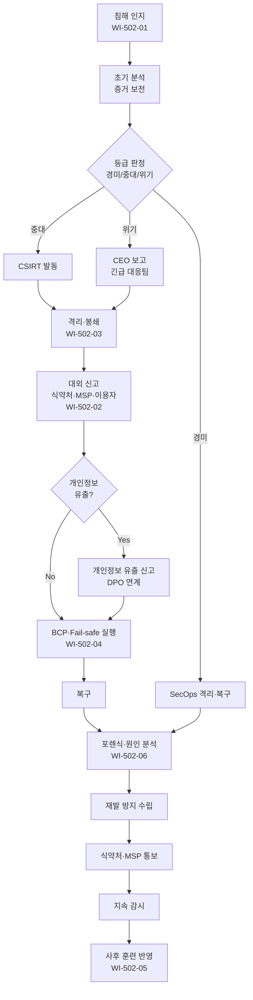

# 침해사고 대응 및 신고 절차 (PRO-MDCS-502)

> 상위 정책: [[POL-MDCS-005_침해행위_대응_정책_v1.0]]

## 1. 목적

전자적 침해행위(랜섬·유출·서비스 마비·악성코드 감염 등) 인지 시, **신속한 대응·법정 신고·환자 안전 보장·사후 재발 방지**가 일관된 프레임으로 수행되도록 절차·역할·기한을 정의한다.

## 2. 적용 범위 (침해 유형 분류 포함)

- **경미(Low)**: 통제 범위 내 격리·복구 완료, 환자 안전·개인정보 영향 없음
- **중대(High)**: 개인정보 유출 가능성, 서비스 장시간 중단, 다수 기기 감염
- **위기(Critical)**: 환자 안전 직접 영향, 대규모 유출, 랜섬 요구, 규제 기관 긴급 보고 대상

의료서비스제공자(MSP) 는 침해 발견 시 식품의약품안전처·제조업자에게 **선택적으로** 알릴 수 있으며, 본 절차에서는 MSP 접수 창구를 함께 정의한다.

## 3. 역할과 책임 (RACI)

| 단계 | SecOps | CSIRT | CISO | CEO | RA | DPO | 홍보/CS |
|---|---|---|---|---|---|---|---|
| 인지·초기 분석 (1차) | **R** | **A** | I | - | - | I | - |
| 등급 분류 | C | **R** | **A** | I (Critical) | I | C | - |
| 격리·봉쇄 | C | **R** | **A** | I | - | - | - |
| 대외 신고 (식약처) | - | C | **R** | A | **R** | C | - |
| 이용자·MSP 공지 | - | C | C | A | C | C | **R** |
| 개인정보 유출 신고 | - | C | C | A | C | **R** | C |
| 복구·BCP 실행 | **R** | **R** | **A** | I | - | - | C |
| 포렌식·원인 분석 | C | **R** | **A** | I | - | - | - |
| 재발 방지 수립 | C | **R** | **A** | I | C | C | - |
| 사후 훈련 반영 | C | **R** | **A** | I | - | - | - |

## 4. 절차 흐름



## 5. 단계별 상세

| # | 단계 | 설명 | 담당 | 입력 | 출력 | 시한 (권장) |
|---|---|---|---|---|---|---|
| 1 | 인지 | SIEM/FIM/제보로 침해 탐지 | SecOps | 탐지 알림 | IR 티켓 | 즉시 |
| 2 | 초기 분석 | 침해 유형·시간·영향 범위 확인, 증거 보전 | CSIRT | 로그·이미지 | 초기 분석 보고 | 2시간 이내 |
| 3 | 등급 판정 | 경미/중대/위기 분류 | CSIRT + CISO | 초기 분석 | 등급 판정서 | 2시간 이내 |
| 4 | 격리·봉쇄 | 감염 자산 격리, 네트워크 차단, 악성코드 제거 준비 | CSIRT | 판정서 | 격리 기록 | 4시간 이내 |
| 5 | 초기 신고 | 식품의약품안전처·의료서비스제공자·이용자 통지 (양식: 침해 유형·발생 시간·인지 시점·초기 영향·조치 상황) | RA + 홍보 | TMP-초기신고서 | 신고 접수번호 | 인지 즉시 (24시간 비상 연락) |
| 6 | 개인정보 유출 신고 | 유출 발견 시 DPO 가 개인정보보호위원회·정보주체 통지 연계 | DPO | 유출 사실 확인 | 유출 신고 기록 | 법정 기한 준수 |
| 7 | BCP·Fail-safe | 제품 사용 연속성 확보 — 비상 운영·백업·대체 시스템·AI Fail-safe | CSIRT + SecOps | BCP 계획 | BCP 실행 기록 | 등급별 RTO 준수 |
| 8 | 복구 | 클린 상태 복구, 무결성 재검증 | CSIRT + 인프라 | 백업 | 복구 완료 기록 | 등급별 RTO 준수 |
| 9 | 포렌식·원인 분석 | SBOM 기반 영향 컴포넌트 연계, 공격 경로 규명 | CSIRT | 보전 증거 | 원인 분석 보고 | 14일 이내 |
| 10 | 재발 방지 수립 | 기술적 강화·프로세스·교육 대책 수립, 식약처·MSP 통보 | CSIRT + CISO | 원인 분석 | 재발방지 보고 | 30일 이내 |
| 11 | 지속 공유 | 조치 상황·추가 분석 결과를 관련 대상에게 지속 공유 | 홍보/CS + RA | 진행 현황 | 커뮤니케이션 기록 | 주 1회 이상 |
| 12 | 지속 감시 | 재발 여부 감시, 대응 계획 주기적 검토·개선 | SecOps | 감시 결과 | 검증 보고 | 90일 |
| 13 | 훈련 반영 | Tabletop/Simulation 훈련 시나리오·CSIRT 교육에 반영 | CSIRT | 교훈 | 훈련 시나리오 | 반기 |

## 6. 연계 업무지침 (WI)

- [[WI-502-01_침해_인지_및_초기분석_v0.1]] — 탐지·증거 보전
- [[WI-502-02_대외신고_식약처_MSP_이용자_v0.1]] — 24시간 신고 체계
- [[WI-502-03_격리_및_복구_포렌식_v0.1]] — 격리·포렌식·복구
- [[WI-502-04_BCP_및_Fail-safe_v0.1]] — 제품 사용 연속성
- [[WI-502-05_CSIRT_구성_및_훈련_v0.1]] — CSIRT 구성·훈련·교육
- [[WI-502-06_재발방지_및_사후분석_v0.1]] — 사후분석·재발방지

## 7. 통제점 / KPI

| 통제점 | 지표 | 목표 | 주기 |
|---|---|---|---|
| 침해 인지→초기 신고 | 법정·내부 기준 시간 | 24시간 이내 100% | 사건별 |
| MTTR (Mean Time To Respond) | 인지→격리 | 중대 ≤ 4시간 | 월 |
| BCP RTO 준수 | 서비스 복구 시간 | 등급별 SLA 준수율 100% | 사건별 |
| 포렌식 완료 기한 | 원인 분석 14일 이내 | ≥ 95% | 분기 |
| IR 훈련 수행 | 반기 Tabletop/Simulation | 각 1회 이상 | 반기 |

## 8. 표준 매핑 (Traceability)

| 표준 조항 | Req-ID | 반영 위치 |
|---|---|---|
| SaMD-CSMS 제17조 제1호 (대응 계획 수립) | MDCS-R-171 | §1, §2, §4 전반 |
| SaMD-CSMS 제17조 제2호 (신고 방안) | MDCS-R-172 | §5 단계 5 |
| SaMD-CSMS 제17조 제3호 (조치 방안) | MDCS-R-173 | §5 단계 4, 8, 9 |
| SaMD-CSMS 제17조 제4호 (위험 관리·SBOM 연계) | MDCS-R-174 | §5 단계 9 |
| SaMD-CSMS 제17조 제5호 (CSIRT 구성) | MDCS-R-175 | §3 RACI, WI-502-05 |
| SaMD-CSMS 제17조 제6호 (제품 사용 연속성·BCP) | MDCS-R-176 | §5 단계 7, WI-502-04 |
| SaMD-CSMS 제17조 제7호 (훈련·Tabletop) | MDCS-R-177 | §5 단계 13, §7 KPI |
| SaMD-CSMS 제17조 제8호 (대응 인력·교육) | MDCS-R-178 | WI-502-05 |
| SaMD-CSMS 제18조 제1호 (인지 기준) | MDCS-R-181 | §5 단계 1~3 |
| SaMD-CSMS 제18조 제2호 (식약처·MSP·이용자 통보) | MDCS-R-182 | §5 단계 5 |
| SaMD-CSMS 제18조 제3호 (초기 신고 포함 정보) | MDCS-R-183 | §5 단계 5 |
| SaMD-CSMS 제18조 제4호 (MSP 선택 신고) | MDCS-R-184 | §2 적용 범위 |
| SaMD-CSMS 제18조 제5호 (지속 정보 공유) | MDCS-R-185 | §5 단계 11 |
| SaMD-CSMS 제18조 제6호 (신고 문서화) | MDCS-R-186 | §5 단계 전반, TMP 연계 |
| SaMD-CSMS 제19조 제1호 (원인·대응 조치) | MDCS-R-191 | §5 단계 9 |
| SaMD-CSMS 제19조 제2호 (재발 방지 통보) | MDCS-R-192 | §5 단계 10 |
| SaMD-CSMS 제19조 제3호 (BCP·Fail-safe 실행) | MDCS-R-193 | §5 단계 7 |
| SaMD-CSMS 제19조 제4호 (MSP 협조) | MDCS-R-194 | §3 RACI (협력) |
| SaMD-CSMS 제19조 제5호 (지속 감시·개선) | MDCS-R-195 | §5 단계 12 |
| SaMD-CSMS 제19조 제6호 (전 과정 문서화) | MDCS-R-196 | §5 전체, §7 KPI |

## 9. 출처 (source_citation)

```yaml
- type: guide
  file: "_inputs/01_표준원문/제17조 침해행위 대응 계획 등.pdf"
  locator: "pp.44-45"
  retrieved_at: "2026-04-17"
  license: "공공저작물 추정 — 확인 필요"
  paraphrase_only: true
- type: guide
  file: "_inputs/01_표준원문/제18조 침해행위 신고.pdf"
  locator: "pp.46-47"
  retrieved_at: "2026-04-17"
  license: "공공저작물 추정 — 확인 필요"
  paraphrase_only: true
- type: guide
  file: "_inputs/01_표준원문/제19조 침해행위 발생 이후의 조치.pdf"
  locator: "pp.48-49"
  retrieved_at: "2026-04-17"
  license: "공공저작물 추정 — 확인 필요"
  paraphrase_only: true
```

## 10. 개정 이력

| 버전 | 일자 | 변경내용 | 승인자 |
|---|---|---|---|
| 1.0 | 2026-04-17 | 최초 제정 (SaMD-CSMS 제17·18·19조 통합) | CEO |
