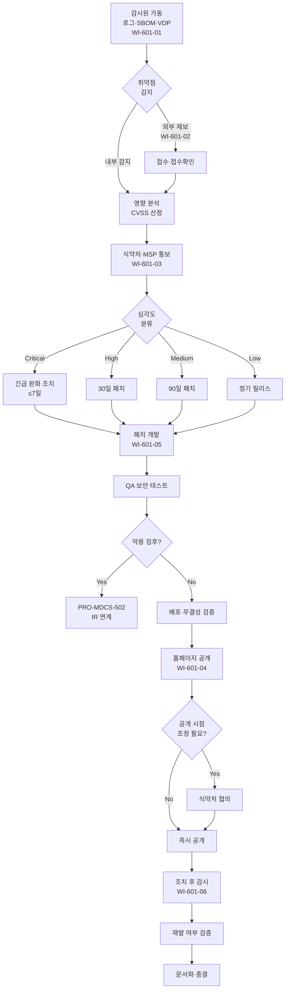

# 취약점 감시·공개·조치 절차 (PRO-MDCS-601)

> 상위 정책: [[POL-MDCS-006_취약점_관리_정책_v1.0]]

## 1. 목적

디지털의료기기에서 확인되는 취약점의 **감시(Monitor) → 공개(Disclose) → 조치(Remediate)** 라이프사이클을 일관된 방식으로 운영하여, 취약점이 침해 사고로 이어지기 전에 적시에 해소하고 이해관계자와 투명하게 소통한다.

## 2. 적용 범위 (심각도 분류 포함)

- 본 절차의 심각도 기준(CVSS 환산):
  - **Critical (≥ 9.0)**: 7일 이내 긴급 완화·패치
  - **High (7.0~8.9)**: 30일 이내
  - **Medium (4.0~6.9)**: 90일 이내
  - **Low (< 4.0)**: 다음 정기 릴리스
- 자사 개발 구성요소 및 **제3자·오픈소스** (SBOM 기반)
- 시판 중 제품 및 **레거시** 제품 (제15조 연계)
- 외부 연구자·의료서비스제공자·내부 감시로 접수된 모든 취약점

## 3. 역할과 책임 (RACI)

| 단계 | PSO | SBOM 관리자 | 개발팀 | QA | CISO | RA | CSIRT |
|---|---|---|---|---|---|---|---|
| 감시 활동 계획·운영 | **A** | **R** | C | - | A | - | I |
| 외부 접수 (VDP) | **R** | - | - | - | A | - | I |
| 영향 분석·심각도 산정 | **R** | **R** | C | C | A | - | C |
| 식약처·MSP 통보 | C | - | - | - | A | **R** | - |
| 홈페이지 공개·시점 조정 | **R** | - | - | - | **A** | C | - |
| 패치 개발 | C | C | **R** | A | I | - | - |
| 조치 배포 (업데이트) | C | C | **R** | **R** | **A** | I | - |
| 조치 후 감시·재발 검증 | **R** | C | C | C | A | - | I |
| 악용 징후 발견 시 IR 연계 | C | - | C | - | A | - | **R** |

## 4. 절차 흐름



## 5. 단계별 상세

| # | 단계 | 설명 | 담당 | 입력 | 출력 |
|---|---|---|---|---|---|
| 1 | 감시 활동 | 정기 보안 모니터링, 로그 분석, 시판 후 감시, SBOM-CVE 연동 주 1회 이상 | PSO + SBOM 관리자 | 로그·CVE 피드·SBOM | 감시 리포트 |
| 2 | 외부 접수 (VDP) | security@도메인 등 접수 채널, ACK 기준 시간 준수 | PSO | 제보 메일/폼 | 접수번호·ACK |
| 3 | 영향 분석 | 영향 받는 제품·컴포넌트 식별, CVSS 산정, 임상 영향 평가 | PSO + 개발팀 | 취약점 상세 | 영향 분석 보고 |
| 4 | 식약처·MSP 통보 | TMP-취약점통보서 (상세·심각도·영향·대응 방안 포함) 제출 | RA | 영향 분석 | 통보 접수번호 |
| 5 | 심각도별 조치 SLA | Critical 7일 / High 30일 / Medium 90일 / Low 정기 | PSO + 개발팀 | CVSS | 조치 계획 |
| 6 | 패치 개발 | 보안 SDLC 에 따라 패치 개발, 제10조 유지관리 기준 준수 | 개발팀 | 계획 | 패치 빌드 |
| 7 | QA 보안 테스트 | 무결성·기능·회귀 테스트, 디지털 서명·해시 생성 | QA | 패치 빌드 | 서명된 배포본 |
| 8 | 배포 | 공식 채널 배포, 배포 중 실패 시 롤백/백업/복원 | 개발팀 + 인프라 | 배포본 | 배포 이력 |
| 9 | 홈페이지 공개 | 상세 내용·영향·대응 방안 포함 자료 게시 | PSO | 대응 자료 | 공개 URL |
| 10 | 공개 시점 조정 | 해결 지연·심각도 고려 시 식약처 협의 | CISO + RA | 상황 판단 | 협의 기록 |
| 11 | 조치 후 감시 | 지속 모니터링·감시로 재발 여부 확인 | PSO + SecOps | 모니터링 결과 | 재발 검증 보고 |
| 12 | 문서화·종결 | 감시·공개·조치 전 과정 문서화 및 취약점 티켓 종결 | PSO | 관련 기록 | 최종 보고서 |

## 6. 연계 업무지침 (WI)

- [[WI-601-01_취약점_감시_및_접수_v0.1]] — 감시 운영·내부 접수
- [[WI-601-02_VDP_운영_외부연구자_v0.1]] — 외부 제보 채널·ACK
- [[WI-601-03_식약처_MSP_통보_v0.1]] — 통보 양식·기한
- [[WI-601-04_홈페이지_공개_및_조정공개_v0.1]] — 공개 자료·시점 조정
- [[WI-601-05_패치_및_업데이트_배포_v0.1]] — 배포·무결성·롤백
- [[WI-601-06_조치후_감시_및_재발검증_v0.1]] — 재발 여부 검증

## 7. 통제점 / KPI

| 통제점 | 지표 | 목표 | 주기 |
|---|---|---|---|
| Critical 취약점 SLA | 7일 이내 완화·패치 | 100% | 사건별 |
| SBOM-CVE 연동 주기 | 조회 주기 | ≥ 주 1회 | 주 |
| VDP 접수 ACK | 접수 후 ACK 시간 | ≤ 3 영업일 | 월 |
| 통보 완료율 | 식약처 통보 대상 건 완료 | 100% | 분기 |
| 조치 후 재발률 | 동일 컴포넌트 재발 | 0건 | 분기 |

## 8. 표준 매핑 (Traceability)

| 표준 조항 | Req-ID | 반영 위치 |
|---|---|---|
| SaMD-CSMS 제20조 제1호 (감시 활동 계획·문서화) | MDCS-R-201 | §5 단계 1, 12 |
| SaMD-CSMS 제20조 제2호 (MSP 알림) | MDCS-R-202 | §5 단계 4 (선택 실행) |
| SaMD-CSMS 제20조 제3호 (식약처·MSP 알림) | MDCS-R-203 | §5 단계 4 |
| SaMD-CSMS 제20조 제4호 (통보 포함 정보) | MDCS-R-204 | §5 단계 4 (TMP-취약점통보서) |
| SaMD-CSMS 제20조 제5호 (MSP 협조) | MDCS-R-205 | §3 RACI (협력 표기) |
| SaMD-CSMS 제21조 제1호 (홈페이지 공개) | MDCS-R-211 | §5 단계 9 |
| SaMD-CSMS 제21조 제2호 (공개 자료) | MDCS-R-212 | §5 단계 9 |
| SaMD-CSMS 제21조 제3호 (공개 시점 조정) | MDCS-R-213 | §5 단계 10 |
| SaMD-CSMS 제22조 제1호 (패치·업데이트 조치·제10조 준수) | MDCS-R-221 | §5 단계 5~8 |
| SaMD-CSMS 제22조 제2호 (레거시 협력 패치) | MDCS-R-222 | PRO-MDCS-303 연계 |
| SaMD-CSMS 제22조 제3호 (조치 후 감시) | MDCS-R-223 | §5 단계 11 |
| SaMD-CSMS 제22조 제4호 (문서화) | MDCS-R-224 | §5 단계 12 |
| SaMD-CSMS 제10조 제1호 (업데이트 무결성) | MDCS-R-101 | §5 단계 7~8 |
| SaMD-CSMS 제10조 제2호 (업데이트 실패 롤백·복원) | MDCS-R-102 | §5 단계 8 |

## 9. 출처 (source_citation)

```yaml
- type: guide
  file: "_inputs/01_표준원문/제20조 취약점 감시.pdf"
  locator: "pp.50-51"
  retrieved_at: "2026-04-17"
  license: "공공저작물 추정 — 확인 필요"
  paraphrase_only: true
- type: guide
  file: "_inputs/01_표준원문/제21조 취약점 공개.pdf"
  locator: "p.53"
  retrieved_at: "2026-04-17"
  license: "공공저작물 추정 — 확인 필요"
  paraphrase_only: true
- type: guide
  file: "_inputs/01_표준원문/제22조 취약점 조치.pdf"
  locator: "pp.55-56"
  retrieved_at: "2026-04-17"
  license: "공공저작물 추정 — 확인 필요"
  paraphrase_only: true
- type: guide
  file: "_inputs/01_표준원문/제10조 유지 관리.pdf"
  locator: "pp.30-31"
  retrieved_at: "2026-04-17"
  license: "공공저작물 추정 — 확인 필요"
  paraphrase_only: true
```

## 10. 개정 이력

| 버전 | 일자 | 변경내용 | 승인자 |
|---|---|---|---|
| 1.0 | 2026-04-17 | 최초 제정 (SaMD-CSMS 제20·21·22조 통합, 제10조 업데이트 준수 포함) | CISO |
